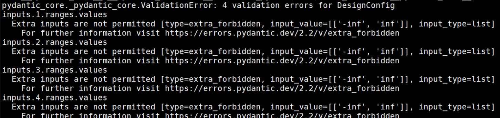

# FAQ一本通

[toc]

---

# 问题定位自查

1. ATK版本是否最新，如果是多机比较，多机ATK**版本需保持一致**；
2. 自查命令是否有误，如果有自定义api，检查注册器名称是否与用例api_type和aclnn_api_type一致；
3. 如果待测算子为aclnn（即第一个backend为pyaclnn），确保参数校验通过，请参考：[参数校验](../各类算子测试指南/PyAclnn自定义API编写指南.md#span-id参数校验aclnn算子签名参数校验span)；
4. 如果出现算子内部报错（例如抛出错误码），请参考：[错误码定位指南](./错误码定位指南.md)；
5. 算子运行失败需找对应算子开发解决；


# 工具安装问题

## 安装了atk但是显示command not found

这是环境变量没有设置好，需要将python的bin路径导入到PATH中`export PATH=xxxx/bin:$PATH`
例如，使用pip show atk查看到安装location为/usr/local/lib/python3.9/site-packages，需要设置环境变量 `export PATH=/usr/local/bin:$PATH`

## 环境变量设置（整包/分包）

CANN包安装完成后需要source环境变量，常用命令参考如下：

```
source /usr/local/Ascend/ascend-toolkit/set_env.sh
source /usr/local/Ascend/driver/bin/setenv.bash
```

没有source环境变量的常见报错：ImportError: libhccl.so

如使用CANN分包，环境变量参考如下，注意`/usr/local/Ascend`为分包安装的路径。
**常见报错：**AttributeError: 'NoneType' object has no attribute 'acl_init'

```
source /usr/local/Ascend/latest/bin/setenv.bash
export ASCEND_HOME_PATH=/usr/local/Ascend/latest
export ASCEND_TOOLKIT_HOME=/usr/local/Ascend/latest
export ASCEND_OPP_KERNEL_PATH=/usr/local/Ascend/latest
export ASCEND_OPP_PATH=/usr/local/Ascend/latest/opp
export ASCEND_AICPU_PATH=/usr/local/Ascend/latest
export TBE_IMPL_PATH=/usr/local/Ascend/latest/opp/built-in/op_impl/ai_core/tbe
export LD_LIBRARY_PATH=${ASCEND_HOME_PATH}/lib64:${ASCEND_HOME_PATH}/runtime/lib64:${ASCEND_HOME_PATH}/compiler/lib64:${ASCEND_HOME_PATH}/compiler/lib64/plugin/opskernel:${ASCEND_HOME_PATH}/compiler/lib64/plugin/nnengine:${ASCEND_HOME_PATH}/tools/aoe/lib64:${ASCEND_HOME_PATH}/opp/built-in/op_impl/ai_core/tbe/op_tiling/lib/linux/aarch64/:$LD_LIBRARY_PATH
export PYTHONPATH=${ASCEND_HOME_PATH}/python/site-packages:${ASCEND_HOME_PATH}/opp/built-in/op_impl/ai_core/tbe:$PYTHONPATH
```

# 用例生成问题

## 数据生成时yaml里面并没有写inf但是还是生成了inf

**同类问题：**没有写nan但是生成了nan，没有写-inf但是生成了-inf
**invalid指的是异常值**，在yaml文件中用户如果没有写异常值，atk工具是会默认生成。用户的测试场景如果不需要异常值，可以将invalid字段设置为与valid一致。

> attr默认invalid：-inf，inf
> scalar默认invalid：-inf，inf，nan
> tensor默认invalid：-inf，inf，nan，null
> tensor默认valid：[[-1, 1], [-7, 7], ["-inf", "inf"]]

## 用例生成卡住

1. 待生成用例本身就比较大，生成时间在合理范围内变长是正常的
2. 用户设置的`max_length`参数不合理，无法生成满足要求的用例

## 如何单独生成边界用例

修改yaml文件：

```yaml
dtype_numbers: 0
extra_numbers: all
```

如需生成指定类型的边界用例，需要单独设置boundary参数：

```yaml
boundary:
    has_empty: false
    has_infnan: false
    has_scalar: false
    has_upper_border: false
    has_lower_border: false
```

## 如何生成类型为数组的入参

在用例生成yaml文件时，可参考以下示例：

```yaml
# tuple_numbers使用示例
  - name: padding
    type: attrs
    required: true
    tuple_numbers:
      values: [ 6 ]
    dtypes:
      values: [ int ]
    ranges:
      valid:
        values: [ 1, 7, 8, 9, 15, 16, 17, 19, 20, 21, 255, 256, 257, 13107, [ 1,1024 ] ]
      invalid:
        values: [["-inf"], ["inf"]]
```

1. 该参数的type设置为**attrs**或**attr_tuple**（*注意不是scalars！*）
2. 如果生成的是int类型的数组，dtype设置为**int**（*注意不是int32！*）
3. 通过**tuple_numbers**设置数组的长度


## pydantic报错：xx validation errors for xx



该问题通常是yaml文件书写有误引起的，主要排查：格式是否正确、是否多/少传了字段

# 自定义API问题

## 需要自己构建随机输入，要如何固定每条用例在不同节点上生成的数据是一样的？

在自定义API中单独设置随机种子`torch.manual_seed()`，其中将用例的case_id作为种子，同时为了避免全局seed被覆盖，建议单独创建一个随机数生成器，例如：

```python
def init_by_input_data(self, input_data: InputDataset):
	g = torch.Generator()
	g.manual_seed(self.task_result.case_config.id)
	torch.rand(3, generator=g)
```

## 算子需要传入空指针

参考资料传送门：

1. [空指针参数](../各类算子测试指南/PyAclnn自定义API编写指南.md#空指针参数对应c的void-arg--nullptr)
2. [空tensor](../各类算子测试指南/PyAclnn自定义API编写指南.md#tensor类型空指针对应c的acltensor-arg--nullptr)
3. [Pyaclnn与C++数据类型对应关系](../各类算子测试指南/PyAclnn自定义API编写指南.md#pyaclnn与c数据类型对应表)

## 如何构造非连续tensor

参考资料传送门：[指定非连续tensor的storage shape](../各类算子测试指南/PyAclnn自定义API编写指南.md#span-idstorage_shape指定非连续tensor的storage-shapespan)

## 如何自定义设置输入tensor的format

参考资料传送门：[指定tensor的format](../各类算子测试指南/PyAclnn自定义API编写指南.md#指定tensor的format)

# 精度测试执行问题

## 单跑正常，批跑出现OOM现象

1. 导入环境变量，禁用资源池：`export PYTORCH_NO_NPU_MEMORY_CACHING=1`
2. 使用[内存检测功能](../任务执行.md#内存检测)检测算子是否存在内存泄漏，如存在，则联系对应算子开发进一步定位。

## 报错：在xxx环境变量中找不到算子workspace接口

1. 确认是否是新增算子，CANN包版本与待测算子是否匹配
2. 检查算子名称书写是否有误
3. atk工具获取aclnn算子的函数所在.so路径顺序如下，可依次在环境变量中查找接口是否存在
   **注意**：如果`${ASCEND_CUSTOM_OPP_PATH}`和`${ASCEND_OPP_PATH}`环境变量都找不到的话，请先source CANN包环境变量，或手动添加。
   ```
   1、${ASCEND_CUSTOM_OPP_PATH}/vendors/customize/op_api/lib/libcust_opapi.so
   2、${ASCEND_OPP_PATH}/vendors/customize/op_api/lib/libcust_opapi.so
   3、${ASCEND_OPP_PATH}/lib64/libopapi.so
   ```

例如我这里`ASCEND_OPP_PATH`环境变量为`/usr/local/Ascend/ascend-toolkit/latest/opp`，查询算子接口：

```
nm -D /usr/local/Ascend/ascend-toolkit/latest/opp/lib64/libopapi.so | grep 算子接口名称
```

## 算子太大执行超时或者超出内存空间

* 工具默认的超时时间为**650秒**，用户可通过`-to`参数设置需要的超时时间；
* 工具默认的并发数为**100**，用户可通过`-mt`参数设置需要的并发数，如遇超大算子或上边界用例，建议设置`-mt 1`

## pyaclnn算子用例执行卡住/入参有缺失

**参数校验解决99%卡住场景**，使用方法：

> 1. 在运行命令时加上`-cp`参数
> 2. 在自定义API中使用`get_cpp_func_signature_type`函数，参考资料传送门：[aclnn算子签名校验](../各类算子测试指南/PyAclnn自定义API编写指南.md#span-id参数校验aclnn算子签名参数校验span)

输入参数类型支持的数据类型请参考：[输入数据支持的数据类型说明](../用例生成.md#输入数据支持的数据类型说明)

## 使用`-p`传入文件夹路径，调用的并不是期望的自定义API

路径下面有重名的自定义API，用户需确保**注册器名称唯一性**。
请**不要取和工具默认API一样的注册器名称**，工具默认的API名称如下：

```python
api_type: function
aclnn_api_type: aclnn_function
triton_api_type: triton_function
fusion_api_type: fusion_function
```

## 自定义API的常用头文件导入

以下头文件仅供参考，请按需导入

```python
from atk.configs.dataset_config import InputDataset
from atk.configs.results_config import TaskResult
from atk.tasks.dataset.base_dataset import OpsDataset
from atk.tasks.api_execute import register
from atk.tasks.api_execute.base_api import BaseApi
from atk.tasks.api_execute.aclnn_base_api import AclnnBaseApi
from atk.tasks.api_execute.triton_base_api import TritonBaseApi
from atk.tasks.api_execute.fusion_base_api import FusionBaseApi
from atk.tasks.api_execute.tf_base_api import TensorflowApi
from atk.tasks.backends.lib_interface.acl_wrapper import AclFormat, AclTensor, TensorPtr
```

## aclnn算子错误码定位方法

传送门：[错误码定位指南](./错误码定位指南.md)
详细信息可以查看aclnn算子日志，默认路径在`/root/ascend/log/debug/plog/`.

## 报错：Index out of range

执行命令有误，一般是使用`-s`和`-e`时出现，start和end为左闭右开，如果两个参数设置为一样或者end大于start时，导致用例获取为空，出现以上报错。

## 标杆输出为非连续/算子输出和工具输出排布不一致

参考解决：[输出非连续tensor](https://wiki.huawei.com/domains/18551/wiki/181566/WIKI202510148568828)

## 精度比对结果不通过/用其他工具比对通过，atk工具不通过

精度比对不通过排查步骤如下：

1. 首先查看结果报表中的“精度详情”列，该列中有详细的精度失败信息
2. 确认使用的精度标准是否一致，同样的输出在不同的精度标准下通过与否不同
3. 如果是非精度标准原因，则通过`--save_data input --save_data output`保存工具输入输出，与自验证脚本结果进行比较。
   （**！注意调用方式要一样，不可以用aclnn二段式直调结果和torchAPI调用结果进行比较**）

## 使用UINT报错：UINTxx不存在

仅torch2.3及以上版本支持uint类型，请升级到配套版本。

## aclnn算子的输出结果和算子dump结果不一致

- 首先排查aclnn自定义api中是否对输出数据进行了修改，如果修改了`output_packages`，那么必须同步修改`input_args`，因为`input_args`=算子输入+算子输出
- 再排查是否与非连续tensor有关，排查思路参考[tensor连续性问题：工具输出与算子输出不一致](https://wiki.huawei.com/domains/18551/wiki/181566/WIKI202510148568828)

## GPU侧出现报错：自定义API找不到

如果算子测试使用自定义API，那么在GPU侧起服务的时候需要加上`--plugin_path`参数，传入自定义API路径。**注意！多机测试时，自定义API文件在每台机器上都要有。**

```
atk server --devices 0 --plugin_path xxxxx.py
```

## GPU测试出现报错：Error: 504 Server Error: Gateway Time-out

取消代理：`unset http_proxy https_proxy`

# 性能测试执行问题

## 报错：The op_summary is null

**算子没有在device侧下发**，msprof工具无法生成op_summary.csv报表，需要确认算子是否在device侧运行。

> **场景一**
> 某算子的uint8用例无法获取到性能数据 --- 某些dtype存在原地更新行为，不会进入device侧运行
> 
> **场景二**
> [tensorflow某些算子无法获取到性能数据](../各类算子测试指南/Tensorflow算子测试指南.md#性能测试) --- 融合规则自动开启会导致无法获取到该算子的性能结果

## 测试e2e性能时，批跑执行失败、结果浮动过大的问题

但测试e2e性能不准确时，可参考以下几个思路进行排查：
1、`__call__`是否包含数据输出的过程，e2e性能测试会统计`__call__`函数的耗时，故该函数应该只涉及算子执行过程。输入数据预处理应放在`init_by_input_data`里，以免影响性能测试。

2、执行性能任务时需按照执行环境去绑核：
```shell
export ATK_BIND_CPU_TYPE=2  # 绑定cpu核的类型， 0为不绑定，1为物理机绑定，2为容器内绑定
```

3、确保环境稳定：重启容器/清理残留进程/是否有资源异常占用