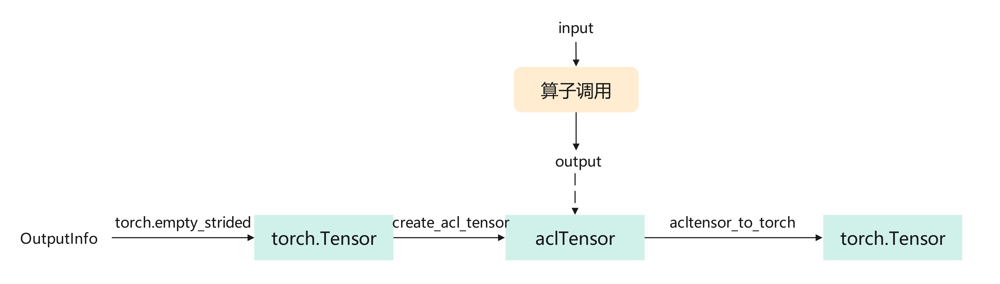
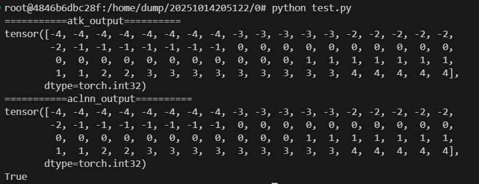

# 非连续tensor输出定位指南

[toc]

---

# 问题场景

在AclnnUniqueDim算子的精度场景下，通过dump导出算子输出、--save_data output保存atk输出，比对两个输出发现结果不一致，导致精度比对失败。

如何dump算子输入输出可参考：[dump算子输入输出数据](./算子输入输出dump指南.md)

# 定位思路

- 首先要搞清楚工具中对算子的output处理过程
  
  - 在`convert_output_data`中通过标杆output的shape、dtype和stride构建一个empty tensor（torch.Tensor的形式），关键代码：
  
  ```python
  def convert_output_data(self, output_data, index):
  	...
  	empty_tensor = torch.empty_strided(output_data.shape, output_data.stride,
                                                   dtype=torch_dtype, device='npu')
  ```
  
  - 在`convert_output_data`中，将构建好的empty tensor转换成aclTensor，该输出的aclTensor将与输出的aclTensor一起传入算子中。关键代码：
  
  ```python
  def convert_output_data(self, output_data, index):
    ...
  	out_tensor = nnopbase.create_acl_tensor(empty_tensor, fmt, storage_shape)
  ```
  
  - 算子执行结束后，结果保存在上述输出aclTensor中，通过`acl_tensor_to_torch`将aclTensor转换回torch.Tensor。关键代码：
  
  ```python
  def acl_tensor_to_torch(cls, tensor_struct: AclTensorStruct) -> torch.Tensor:
       # 从AclTensorStruct里拿我们当初创建aclTensor时存的信息用于进行数据拷贝
       tensor = tensor_struct.pytensor
       data_size = tensor_struct.data_size
  
       # 将算子的计算结果从device侧拷贝回host侧
       npu_addr = tensor_struct.addr
       cpu_addr = tensor.data_ptr()
       ascendcl.aclrtMemcpy(cpu_addr, data_size, npu_addr, data_size,
                            AclrtMemcpyKind.ACL_MEMCPY_DEVICE_TO_HOST)
       return tensor
  ```
  
  其中，tensor为torch.empty创建的torch.Tensor，data_size为acl_dtype大小，调用`aclrtMemcpy`
  将算子的计算结果从device侧拷贝到host侧。
  
  - output转换流程如下图所示：
  
  

- 接着比对一下两个输出tensor中的元素集合是不是一致，确认在acltensor->torchTensor的转换过程中元素都保存下来了

```python
torch.equal(torch.sort(atk_output.flatten()).values, torch.sort(aclnn_output.flatten()).values)
```

运行脚本可以发现两个输出的元素集合是一致的，是排布方式不同导致的精度比对失败。这里猜想可能是输出数据为非连续tensor导致的，下面进一步验证。



- 由于aclnn算子的输出构造依赖于标杆输出，因此检查标杆输出是否为连续.

```python
def __call__(self, input_data: InputDataset, with_output: bool = False):
	...
	res = torch.unique(input=input_data.kwargs["self"], sorted=input_data.kwargs["sorted"], return_inverse=input_data.kwargs["returnInverse"],
                                   return_counts=True, dim=input_data.kwargs["dim"])
	output = res[0]
	inverse_indices = res[1]
	counts = res[2]
	print(output.is_contiguous(), inverse_indices.is_contiguous(), counts.is_contiguous())
```

打印发现第一个输出output为非连续tensor。
根据上述output处理流程，torch.empty_strided会为aclnn算子输出构建一个非连续tensor，而算子内部处理过程中会将非连续的tensor转换为连续tensor进行计算，并且`aclrtMemcpy`是一条线性的memcpy，不会理解stride进行跳步，只是进行连续复制。
这样，在将输出数据从device侧复制到host侧时，实际上是**将一个连续的tensor复制到非连续的tensor里面**，造成的结果就是tensor在逻辑层面上元素排列错乱。

> 非连续tensor→连续tensor还可能导致的问题：
> 
> 1. 某些情况下还可能​**越界写内存**​（因为非连续 tensor 的 storage 可能比逻辑 shape 更小或有间隙）
> 2. `torch` 读出时会出现 **花数据、nan、inf 或随机值**
> 3. 严重时会导致 ​**segfault / bus error**​（尤其是在 PyTorch + NPU 结合场景）

# 解决方法

需要确保host侧的tensor是连续的，在标杆侧将输出output进行连续。

```python
output = res[0].contiguous()
inverse_indices = res[1].contiguous()
counts = res[2].contiguous()
```

# 附录：tensor连续与非连续

## 基本概念

* ​**连续（contiguous）Tensor**​：内存中的数据按 tensor 的逻辑顺序排列，没有跳跃或间隔。
* ​**非连续（non-contiguous）Tensor**​：内存布局不再紧密，某些操作改变了 stride，使得逻辑顺序与实际内存顺序不一致。

## 如何判断是否连续

使用`tensor.is_contiguous()`可进行判断，True为连续，False为非连续

## 影响连续性的操作

| 操作                          | 可能结果               |
| ------------------------------- | ------------------------ |
| `.t()`/`.transpose()` | 非连续                 |
| `.permute()`              | 非连续                 |
| 切片带步长`x[:, ::2]`     | 非连续                 |
| 花式索引`x[[0,2], :]`     | 非连续                 |
| `reshape`（未拷贝）       | 可能连续，也可能非连续 |

## 连续化操作

使用`tensor.contiguous()`将 tensor 的内存重新排列为连续形式，返回一个新的 tensor（如果原本已经连续，则不拷贝）。

## 连续tensor与非连续tensor进行比对

### torch.equal

`torch.equal()`只比较两个 tensor 在逻辑视图（view shape）上的内容是否相同​，
不会关心底层的 storage layout（storageshape 或 stride）是否一致。
因此使用`torch.equal`对viewshape一样的连续tensor和非连续tensor进行比较时，返回结果为true。

### MD5比较

MD5关注tensor的底层排布，连续的tensor和非连续的tensor会得到不一样的MD5值，此时比对的返回结果为false。
