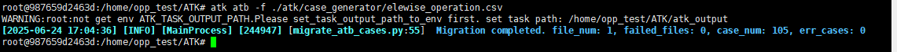
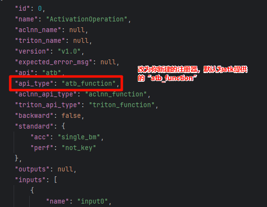

# ATB算子测试指南

[toc]

---


为了方便用户能快速了解工具，本指导从**工具安装、用例生成、数据生成、构造标杆、算子验证**几个关键阶段介绍其使用方法介绍atb算子测试的完整流程。

# 环境准备

1. 完成Toolkit开发套件包、Kernels算子包、NNAL神经网络加速库安装，参考链接：[CANN安装指南](https://www.hiascend.com/document/detail/zh/canncommercial/83RC1/softwareinst/instg/instg_0008.html?Mode=PmIns&InstallType=local&OS=Debian&Software=cannToolKit)

2. ATK工具安装

```bash
pip3 install ATK*.whl
```


# 用例生成

## 生成方式一：csvopstest用例迁移

在ATB测试工具中，使用CSV文件来构造函数入参形状、指定算子信息等，我们提供一个迁移脚本用于将CSV格式用例转换为ATK所需的Json格式用例。

执行以下命令进行用例生成：

```bash
# 执行脚本
atk atb -f  {input_path} -o {output_path} -l {log_level}
# demo
atk atb -f  ElewiseOperation.csv  # 单文件迁移
atk atb -f  ElewiseOperation.csv -o atk_output/ -l debug --no_file
atk atb -f high_level_test/ -o atb_output/ # 批量迁移
```

输入参数:

| 参数               | 类型 | 是否必选 | 默认值 | 说明 |
|------------------| --- | --- | --- | --- |
| -f,--case_file   | str | 是 | 无 | ATB csv用例文件路径，当指定目录时搜索该目录下所有csv文件 |
| -o,--output_path | str | 否 | . | ATK json用例输出位置，默认当前路径 |
| -l,--log         | str | 否 | info | 日志等级 |
| -sv,--soc_version | str | 否 |  | 设备名称 |
| -nf,--no_file    | store_true | 否 | False | 不使用bin文件 |

输出：文件名与csv文件名一致
用例：{output_path}/ElewiseOperation.json
日志：{output_path}/migrate.log

> 使用debug日志等级可以查看csv和生成的json的路径信息

观察到以下输出即为转换成功：



## 生成方式二：yaml泛化生成

### 编写用例设计yaml

在进行用例生成之前，需要设计用例生成的各类参数的yaml文件，atk工具通过解析文件信息自动生成用例集，测试atb算子，inputs参数的所有输入需严格按照算子的输入顺序填写

<div style="display: flex; align-items: center; gap: 15px; background-color: #f0faff; border-left: 5px solid #2e86de; padding: 12px 18px; margin: 15px 0; border-radius: 8px; font-family: -apple-system, BlinkMacSystemFont, 'Segoe UI', Roboto, 'Helvetica Neue', Arial, sans-serif;">
<div style="flex-shrink: 0;">
</div>
<span style="font-size: 26px; color: #2e86de;">ⓘ</span>
<div style="line-height: 1.6;">
<strong style="color: #2e86de;">拓展阅读</strong>
<p style="margin: 0; color: #333;">了解更详细的模板yaml的解析，请参阅 <a href="../用例生成.md" target="_blank" rel="noopener noreferrer" style="color: #1a6ab5; font-weight: 500; text-decoration: none; border-bottom: 1px solid #a8cfff;">用例生成</a>。</p>
</div>
</div>

csvopstest的用例生成yaml：

```yaml
op_name: CumsumOperation
op_param:
  - key: axes
    values: [[0], [1], [2], [4], [5]]
  - key: exclusive
    values: [ false ]
  - key: reverse
    values: [ false ]
in_num: [1]
in_dtype: ["ACL_FLOAT16"]
in_format: ["ACL_FORMAT_ND"]
in_shape:
  dim_numbers: [2, 3, 4, 5, 6]
  dim_number_weights: [0.2, 0.2, 0.2, 0.2, 0.2]
  dim_values: [[2, 3], [7, 9], [15, 17], [19, 21], [23, 30]]
  dim_value_weights: [0.2, 0.2, 0.2, 0.2, 0.2]
data_gen_range: ["0,1", "-100,100"]
```

ATK的用例生成yaml：

```yaml
# op_max.yaml
api: atb
api_type: atb_function
version: v2.1
name: CumsumOperation
generate: default
backward: false
standard:
    acc: single_bm
    perf: not_key
inputs:
  - name: input0
    type: tensor
    required: true
    dtypes:
      values: [ fp16 ]
    ranges:
      valid:
        values: [ [2, 3] ]
      invalid:
        values: [ [2, 3] ]
    shapes:
      dim_numbers:
        values: [2, 3, 4, 5, 6]
  - name: in_formats  # 固定关键字
    type: attr
    required: true
    dtypes:
      values: [ string ]
    ranges:
      valid:
        values: [ "nd" ]
      invalid:
        values: [ "nd" ]
  - name: op_param  # 固定关键字
       # 待做
```

### 用例生成

用户设计完用例参数yaml文件后，可以通过ATK工具生成泛化用例，操作命令参考如下，其中torch.max.yaml是aclnnMaxDim算子的用例设计文件，可自定义用例设计文件名称，该方式会按照默认的数据生成规则来生成输入数据：

```
atk case -f atk/tests/torch.max.yaml
```

> 用例结果会保存在`result/torch.max/json/all_torch.max.json`下
> 更多使用参数说明可执行`atk case --help`查看

- 如需使用参数约束插件，可执行以下命令生成测试用例，该方式会通过自定义生成规则`reduce`来生成输入数据，`-p`入参为文件路径，表示自定义用例生成规则：

```
atk case -f atk/tests/torch.max.yaml -p atk/case_generator/generator/generate_types/generate_reduce.py
```

### 参数约束（可选）

当算子API的输入包含多个参数时，不同输入参数之间有可能存在依赖关系。
此时由于工具无法准确获悉其依赖情况，导致泛化组合生成的测试用例存在问题，出现算子执行异常。因此需要用户对生成的用例进行合理修正，确保用例满足要求。
本工具提供了统一的插件入口，为用户实现较为复杂的用例约束场景。以测试aclnnMaxDim算子为例，参数dim对输入tensor有依赖关系，dim参数需要reduce的维度信息，取值范围需要小于tensor输入参数的维度，实现接口参考如下：

```python
import random
from atk.case_generator.generator.generate_types import GENERATOR_REGISTRY
from atk.case_generator.generator.base_generator import CaseGenerator
from atk.configs.case_config import CaseConfig

@GENERATOR_REGISTRY.register("reduce")
class ReduceGenerator(CaseGenerator):
    def after_case_config(self, case_config: CaseConfig) -> CaseConfig:
        '''
        用例参数约束修改入口
        :param case_config:  生成的用例信息，可能不满足参数间约束，导致用例无效
        :return: 返回修改后符合参数间约束关系的用例，需要用例保障用例有效
        '''
        dim = len(case_config.inputs[0].shape)  # 获取第一个tensor参数shape最大维度值
        range_is_null = case_config.inputs[0].is_range_null()  # 判断是否为空tensor
        if range_is_null:
            case_config.inputs[1].range_values = [0]  # 空tensor设置维度值为0
        else:
            case_config.inputs[1].range_values = [random.randint(-dim, max(0, dim - 1))]  # 非空tensor设置dim在可选范围内随机
        return case_config  # 返回修改和符合参数约束的用例
```

> 在yaml文件中`generate`字段，将`default`修改为注册名称`reduce`

# 参数预处理与构造标杆

## 标杆构造

标杆构造的执行流程分为两步：

1. **准备数据**：
   * 解析json入参用例，将其内容分为三类：`in_tensors`、`in/out_formats`和`op_params`。
   * 用`in_formats`格式化`in_tensors`。
2. **执行计算**：
   * 将准备好的`in_tensors`和`op_params`一同送入 `golden` 函数进行计算。

其返回值就是用作对比的**标杆输出值**。

### 调用方式

在任务执行时通过命令行参数`-ap`将`data_generation.py`**所在的文件夹**传给atk：
例如当前`data_generation.py`的位置是`atk/tasks/api_execute/data_generation.py`，调用方式如下：

```bash
atk {其他参数} task -ap atk/tasks/api_execute/
```


## 自定义Api执行

该部分主要定义了每个api在各个后端平台上是**如何通过生成的数据，执行生成输出结果**，同时返回值也会作为精度和性能对比测试的核心部分。

### 新建类

新建类并继承基类`AtbFunctionApi`，并注册至注册器中，注册名用于在api用例设计阶段配置yaml文件中的`api_type`参数。。

```python
from atk.common.log import Logger
from atk.tasks.api_execute import register
from atk.tasks.api_execute.atb_api import AtbFunctionApi

logging = Logger().get_logger()
# "sample"为自定义API调用方式注册到系统中的名称，需唯一，用于在api的yaml配置文件中配置 api_type 参数。
@register("sample")
class SampleApi(AtbFunctionApi):  # SampleApi类型仅需设置唯一即可。
    """
    def __init__(self, task_result: TaskResult):
        pass
    """
```

相应的yaml/json中将`api_type`字段改为你新建的API类对应的注册器名称，以上述示例代码为例，此处应该为`"api_type": "sample",`：



### 参数预处理

当一个算子涉及以下三种情景时：

1. 希望api能够根据当前的输入数据信息进行部分的初始化参数
2. 希望调整入参的格式或内容
3. 希望执行一些逻辑但不计入算子e2e耗时

可以在`init_by_input_data`这个接口实现，`init_by_input_data`会在任意backend下被调用。

> atk提供的默认参数预处理(`super().init_by_input_data(input_data)`)进行了以下操作：
> 
> * 解析json入参用例，将其内容分为三类：`in_tensors`、`in/out_formats`和`op_params`。
> * 用`in_formats`格式化`in_tensors`。

以下代码为atk提供的默认参数处理方式，可据此修改。

说明：
self.in_formats 是赋值给标杆用的，input_data.kwargs[key] = self.in_formats 是赋值给算子用的

```python
def init_by_input_data(self, input_data: InputDataset):
    super().init_by_input_data(input_data)
    i = 0
    in_formats = self.in_formats
    op_params = self.op_params

    # 以下内容以GatingOperation的customize函数内容为示例
    json_data = json.loads(op_params)
    topk_expert_num = json_data['topkExpertNum']
    cum_sum_num = json_data['cumSumNum']
    if cum_sum_num == 0:
        cum_sum_num = random.randint(64, 128)
    for key, value in input_data.kwargs.items():
        if isinstance(value, torch.Tensor):
            if i == 0:
                unused_expert = set(range(cum_sum_num))
                selected_expert_num = 0
                for shape in range(value.shapes[0]):
                    cur_expert = random.choice(list(unused_expert))
                    in_tensor_topk[shape] = cur_expert
                    unused_expert.remove(cur_expert)
                    selected_expert_num += 1
                    if selected_expert_num == topk_expert_num:
                        unused_expert = set(range(cum_sum_num))
                        selected_expert_num = 0
                value = in_tensor_topk
            if i == 1:
                index_num = value.shapes[0]
                index_array = torch.arange(0, index_num, dtype=dtype_dict[datatype])
                value = index_array
            # GatingOperation的customize函数示例结束

            input_data.kwargs[key] = value  # input_data是atb算子需要用的入参
            self.in_tensor_list[i] = value  # self.in_tensor_list是标杆需要用的入参
            i = i + 1
```

### 标杆实现

在这里会将前面准备好的`in_tensors`和`op_params`一同送入 `golden` 函数进行计算。

```python
def __call__(self, input_data: InputDataset, with_output: bool = False):
    op_params = self.op_params
    in_tensors = self.in_tensor_list

    json_data = json.loads(op_params)
    seq_len_list = json_data['qSeqLen']
    head_num_imm = json_data['headNum']
    y_input = in_tensors[0]
    y_grad = in_tensors[1]
    golden_result = torch.empty_like(y_input)
        
    start = 0
    for seq_len in seq_len_list:
        end = start + head_num_imm * seq_len * seq_len
        sample_y_input = y_input[start:end].reshape(-1, seq_len).to(torch.float32)
        sample_y_grad = y_grad[start:end].reshape(-1, seq_len).to(torch.float32)
        sample_x_grad = torch.empty(size=(head_num_imm * seq_len, seq_len), dtype=torch.float16)
        for i in range(head_num_imm * seq_len):
            grad_matrix = torch.diag(sample_y_input[i]) - torch.ger(sample_y_input[i], sample_y_input[i])
            sample_x_grad[i] = torch.mv(grad_matrix, sample_y_grad[i]).to(torch.float16)
        golden_result[start:end] = sample_x_grad.reshape(-1)
        start = end
        
    return [golden_result]
```

### 调用方式

文件实现自定义的API调用方式，并将yaml配置文件中的api_type修改为实现文件中注册器填写的名称，且在任务执行时将自定义文件路径通过-p方式传入：

```bash
atk task -p function_api.py
```


# 精度测试

以精度测试为例，执行下面命令进行测试：

```bash
atk node --backend atb --devices 0 --task accuracy node --backend cpu task -c ElewiseOperation.json -ap atk/tasks/api_execute/ -e 1
```

其中`ElewiseOperation.json`为atb用例设计文件经转换后的ATK用例设计文件

> **注意：csv中的序号从1开始，而ATK的json序号从0开始**

完整的参数说明可以参考：[任务执行-参数说明](../任务执行.md#参数说明)

执行完成后，输出整体结果如下，同时也在output_test目录中会生成excel报告

```shell
+-------+----------+------------+--------------+
|  名称 | 总用例数  | 精度通过率 | 精度是否达标  |
+-------+----------+------------+--------------+
| cpu_0 |    1     |   100.0    |     Pass     |
+-------+----------+------------+--------------+
```

> 报告中显示全部用例精度或性能Pass即为测试通过，否则请查看excel文件中不通过算子的详细原因

<div style="display: flex; align-items: center; gap: 15px; background-color: #f0faff; border-left: 5px solid #2e86de; padding: 12px 18px; margin: 15px 0; border-radius: 8px; font-family: -apple-system, BlinkMacSystemFont, 'Segoe UI', Roboto, 'Helvetica Neue', Arial, sans-serif;">
<div style="flex-shrink: 0;">
</div>
<span style="font-size: 26px; color: #2e86de;">ⓘ</span>
<div style="line-height: 1.6;">
<strong style="color: #2e86de;">拓展阅读</strong>
<p style="margin: 0; color: #333;">了解更详细的结果分析，请参阅 <a href="../结果分析.md" target="_blank" rel="noopener noreferrer" style="color: #1a6ab5; font-weight: 500; text-decoration: none; border-bottom: 1px solid #a8cfff;">结果分析</a>。</p>
</div>
</div>


# FAQ

## ATB算子的日志输出在哪里？日志等级？

默认输出路径为`/root/atb/log`
日志等级指令：

```shell
export ASDOPS_LOG_TO_STDOUT=1
export ASDOPS_LOG_LEVEL=INFO
```

## 如何使用读取大模型dump信息功能

- 方式一：csv转json时，若填写了`InTensorFile`、`OutTensorFile`字段，则会自动使用。若不希望使用这些dump信息，可使用`-nf`指令关闭。

- 方式二：使用用例yaml生成json时，将tensor的dtype字段改为`load_tensor_data`，然后在`range_values`里填写bin文件路径即可。
