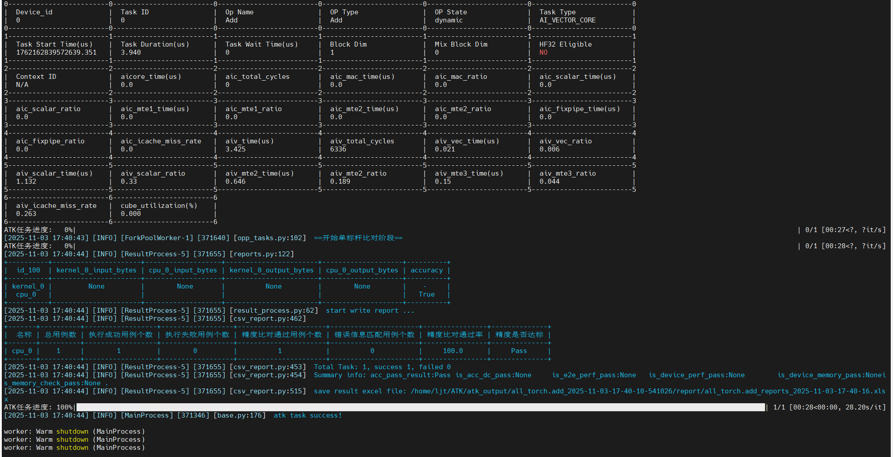
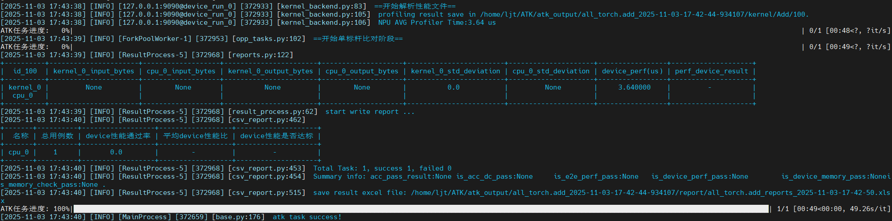

# Kernel算子测试指南

[toc]

---

# 环境准备

1、基本环境配置

- 建议python3.8+，torch 2.1.0+ ，其他依赖包会在安装ATK工具时自动安装
- 完成CANN包安装，对应版本的torch_npu安装
- 自定义算子请先完成编译部署：[算子编译部署-昇腾社区](https://www.hiascend.com/document/detail/zh/mindstudio/81RC1/ODtools/Operatordevelopmenttools/atlasopdev_16_0024.html)

2、ATK工具安装
下载并安装ATK工具包

```
pip install ATK*.whl
```

# 测试用例生成

## 编写测试设计yaml

根据需要测试的算子输入参数信息，编写对应的测试设计yaml文件，详细参数说明可参考：[用例生成](../用例生成.md)

yaml文件中的kernel关键参数如下：

```yaml
kernel_name:  Add # 默认为 None，测试的Kernel算子名称
kernel_api_type: kernel_function # 默认为 kernel_function （工具自带），如果是自定义执行方式，需自定义文件中的注册名字一致，使用方法与api_type相同
```

以测试Add算子kernel为例，`add.yaml`完整文件如下：
**注意：所有非tensor输入，都需要提供参数名称！！！**

```yaml
api: pytorch
version: v2.1
name: torch.add # torch标杆算子名, 默认为 None
api_type: function # 标杆执行器, 默认为 kernel_function（工具自带）
kernel_name:  Add # 测试的Kernel算子名称, 默认为 None
kernel_api_type: kernel_function # kernel算子执行器, 默认为 kernel_function（工具自带），支持自定义，与自定义执行器的注册名字一致
generate: generate_add # 自定义参数约束
dtype_numbers: 700 # 每种输入dtype生成用例数
standard:
  acc: single_bm # 精度标准
  perf: not_key # 性能标准
inputs:
  - name:
    type: tensor
    required: true
    dtypes:
      values: [ fp32, fp16, bf16 ]
    ranges:
      valid:
        values: [ [-100,100] ]
      invalid:
        values: [ [-100,100] ]
    shapes:
      dim_numbers:
        values: [ 1, 2, 3, 4, 5 ]
      dim_values: 
        values: [ 1,2,3,4,255,256]
      max_length: 196608
  - name:
    type: tensor
    required: true
    dtypes:
      values: [ fp32, fp16, bf16 ]
    ranges:
      valid:
        values: [ [-100,100] ]
      invalid:
        values: [ [-100,100] ]
    shapes:
      dim_numbers:
        values: [ 1, 2, 3, 4, 5 ]
      dim_values: 
        values: [ 1,2,3,4,255,256]
      max_length: 196608
```

## 编写自定义参数约束

如果算子的输入参数之间存在约束，需要编写对应的参数约束脚本，具体方法请参考：[自定义规则约束](../用例生成.md#自定义规则约束)

以add算子为例，generate_add.py完整文件如下：

```python
# generate_add.py

import random
from atk.case_generator.generator.generate_types import GENERATOR_REGISTRY
from atk.case_generator.generator.base_generator import CaseGenerator
from atk.configs.case_config import CaseConfig


@GENERATOR_REGISTRY.register("generate_add")  # generate_add为注册的生成器名称，对应yaml中的generate参数
class ReduceGenerator(CaseGenerator):

    def after_case_config(self, case_config: CaseConfig) -> CaseConfig:
        '''
        用例参数约束修改入口
        :param case_config:  生成的用例信息，可能不满足参数间约束，导致用例无效
        :return: 返回修改后符合参数间约束关系的用例，需要用例保障用例有效

        广播约束：
        1、两个tensor必须有有相同维度
        2、每一位的值必须相同，或者为1
        igamma算子约束：
        tensor[i]为负数，或者两个都为0时，该位计算结果为nan
        '''
        case_config.inputs[1].shape = case_config.inputs[0].shape
        case_config.inputs[1].shape = [1 if random.randint(0, 1) else shape_value for shape_value in case_config.inputs[1].shape]
        return case_config
```

## 生成测试用例

执行ATK工具，生成对应算子的泛化测试用例，其中`XXX.yaml`为测试设计yaml文件（必选），`XXX.py`为参数约束脚本（可选），具体的执行参数可参考链接：[Wiki：用例生成](https://wiki.huawei.com/domains/18551/wiki/181566/WIKI202502286101470)

```
atk case -f XXX.yaml -p XXX.py

# 例：atk case -f add.yaml -p generate_add.py
```

# 自定义执行器

## 自定义kernel执行器

目前执行kernel算子接口的调用，绝大部分算子可以通过工具自带的`kernel_function`实现，如果存在需要自定义API的情况，可以参考以下`kernel_function`实现案例进行实现。

`kernel_function`实现案例如下：

```python
import torch

from atk.configs.dataset_config import InputDataset
from atk.tasks.api_execute import register
from atk.tasks.api_execute.kernel_base_api import KernelBaseApi
from atk.tasks.backends.tools.init import tiktools

@register("kernel_function")
class KernelFunctionApi(KernelBaseApi):
    def __call__(self, input_data: InputDataset, with_output: bool = False):

        # 构造算子的tensor输入列表，工具生成的 tensor 均为 torch.Tensor，需要转成 numpy
        numpy_inputs = []
        for item in list(input_data.args or []) + list(input_data.kwargs.values() or []):
            if isinstance(item, torch.Tensor):
                numpy_inputs.append(item.cpu().numpy())

        # 构造算子的其他输入（除tensor外），除了tensor之外的输入，通过attr_dict传入，默认调用工具内部函数，也可以自定义
        attr_dict = self.get_attr_dict(input_data)

        # 构造算子的输入信息列表：inputs_info，默认调用工具内部函数，也可以自定义
        inputs_info = self.get_inputs_info(input_data)

        # 构造算子的输出信息列表：outputs_info，建议调用工具内部函数
        outputs_info = self.get_outputs_info()

        # 调用tik_tools工具接口，获取输出算子输出
        output = tiktools.run(self.task_result.case_config.id,
                              self.kernel_name,
                              inputs_info,
                              numpy_inputs,
                              outputs_info,
                              attr_dict,
                              device_id=self.device_id)

        if isinstance(output, list):
            output = torch.from_numpy(output[0])
        else:
            output = torch.from_numpy(output)
        return output
```

## 自定义标杆

通过设置如下两个参数，可以控制使用哪个torch api作为标杆：

```yaml
name: torch.add # torch标杆算子名, 默认为 None
api_type: function # 标杆执行器, 默认为 kernel_function（工具自带）
```

如果torch没有对应的标杆接口，请参考：[自定义API实现](../任务执行.md#自定义api执行方式)

# 精度测试

执行精度测试时，第一个节点设置为 `--backend kernel`，第二个节点根据选取的标杆类型通常设置`--backend cpu`，执行任务选择`--task accuracy`。

其他执行参数的具体说明参考：[任务执行-参数说明](../任务执行.md#参数说明)
执行命令示例如下：

```
# CPU作为标杆
atk node --backend kernel --devices 0 node --backend cpu task -c all_torch.add.json --task accuracy

# 自定义kernel执行器&自定义标杆场景
atk node --backend kernel --devices 0 node --backend cpu task -c 测试用例.json --task accuracy -p 自定义标杆.py/自定义kernel执行器.py
```

如果需要和GPU进行比较，则需要在GPU节点上安装ATK工具，并启动ATK的服务，参考：[多机执行](../任务执行.md#多机在线执行)
然后执行如下测试命令：

```
# GPU作为标杆
atk node --backend triton --devices 0 node --backend gpu -h gpu 环境的IP -p 环境端口号 --devices 0  -c all_torch.add.json --task accuracy
```

执行结果如下图所示：


在执行命令的目录下，会生成`atk_output`目录，介绍如下：

```yaml
--atk_output
  --all_算子名_时间戳
    --log # 任务日志
      atk.log 
    --report # 任务报告
      all_算子名_reports_时间戳.xlsx 
    --kernel   # tik_tools工具保存文件，默认保存
    --input    # 输入数据，默认不保存
    --output   # 输出数据，默认不保存
```

# 性能测试

## 直接和标杆比较性能

执行性能测试时，节点参数设置与精度测试相同，执行任务选择`--task performance_device`
其他执行参数的具体说明参考：[任务执行-参数说明](../任务执行.md#参数说明)
命令示例如下：

```
atk node --backend kernel --devices 0 node --backend cpu task -c all_torch.add.json --task performance_device
```

**性能结果excel报表默认保存，路径为`./atk_output/all_算子名_时间戳/kernel/kernel名称/用例id/prof*/mindstudio_profiler_output`**

执行结果如下图所示：

