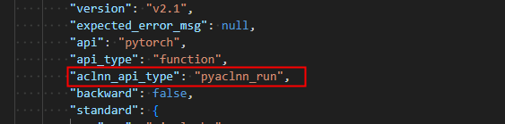
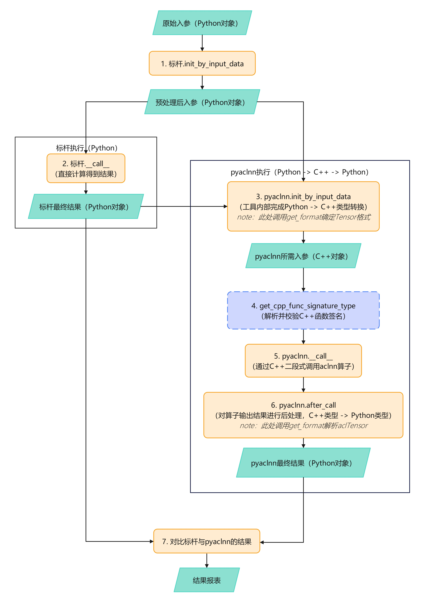
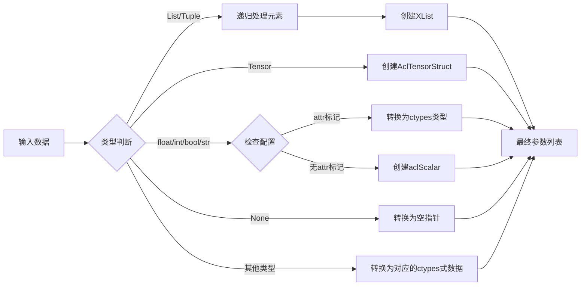
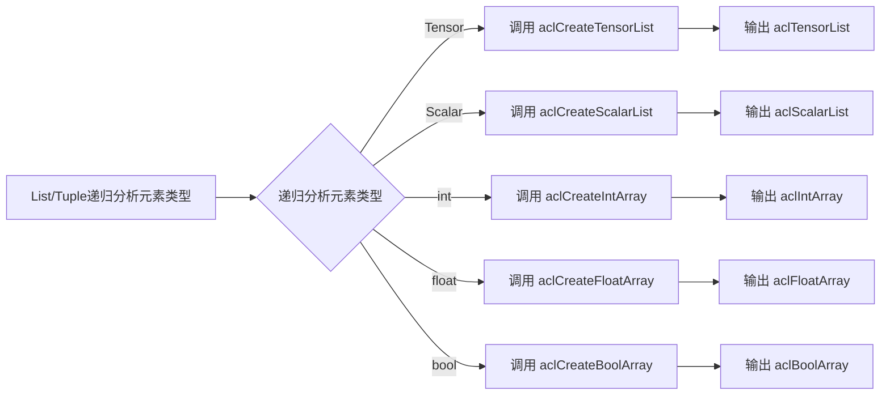
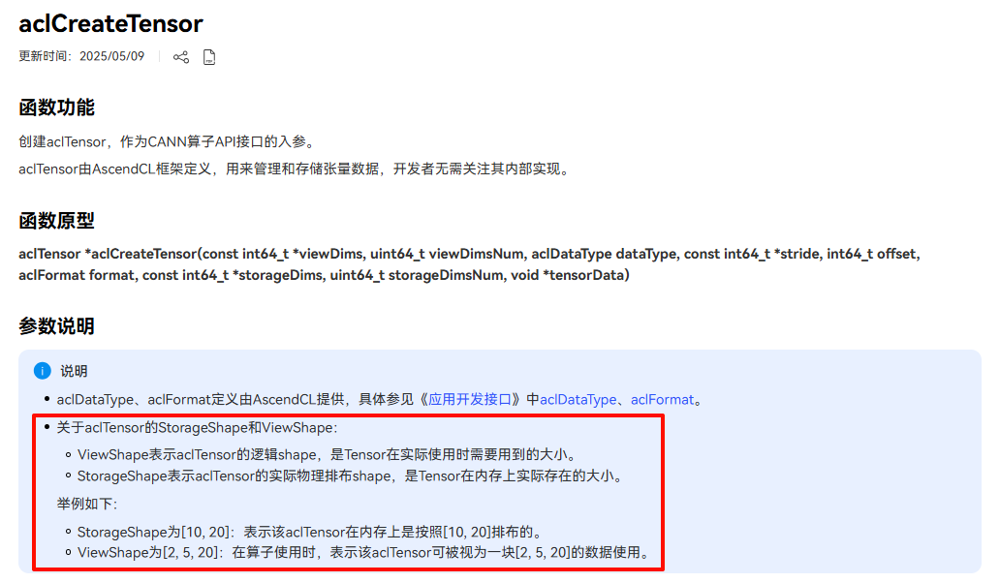
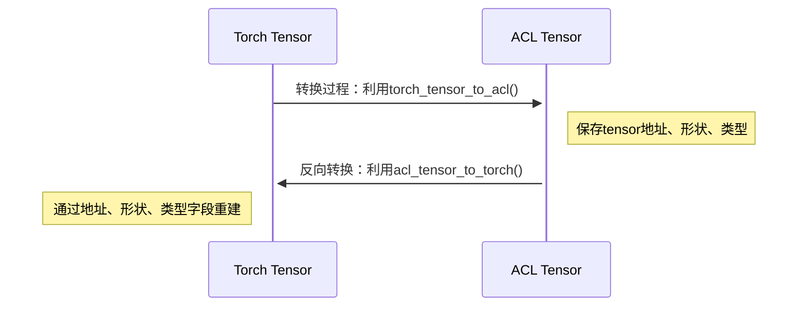

# PyAclnn自定义API编写指南

[toc]

---

# 快速开始

## 使用文档阅读指引

* PyAclnn自定义API模块共提供了6个API函数，查阅索引如下：

| 函数名 | 对应章节 | 函数作用 |
| ---       | ---          | ---          |
| `init_by_input_data` | <a href="#2">【章节2】</a> | 算子参数预处理API |
| `__call__`                   | <a href="#3">【章节3】</a> | 算子调用执行API |
| `after_call`                | <a href="#4">【章节4】</a> | 算子结果后处理API |
| `get_cpp_func_signature_type`| <a href="#参数校验">【章节5】</a> | aclnn调用算子签名参数校验 |
| `get_format`                | <a href="#format">【章节6】</a> | 指定tensor的format格式 |
| `get_storage_shape`                | <a href="#storage_shape">【章节7】</a> | 指定tensor的storage_shape |

其中，ATK提供了一种默认的`init_by_input_data`函数实现，实现详解可参考<a href="#默认参数处理方法">【章节2.1】</a>
用户可以选择两种方式进行自定义：

1. 若无需对处理流程进行修改，可直接阅读 章节4 根据典型场景选择对应实现，并在实现时使用`super().init_by_input_data(input_data)`以继承默认传参方式
2. 若需要对处理流程进行修改，或希望了解处理流程的细节，需阅读<a href="#3">【章节3】</a>
3. 若需要深入了解框架对两种语言之间的转换逻辑，则需要阅读<a href="#8">【章节8：关于Tensor数据类型详解】</a>

* 我们提供了许多现成的典型案例供读者参考，若您的需求已存在于案例中，则可直接参考<a href="#9">【章节9：典型场景解决方案】</a>来实现你的自定义API，案例无法满足时再阅读文档中的其他部分。

## 基础API实现

新建类并继承基类`AclnnBaseApi`，并注册至注册器中，注册名主要用于在api用例设计阶段配置yaml文件中的`aclnn_api_type`参数。

```python
from atk.tasks.api_execute.aclnn_base_api import AclnnBaseApi

@register("sample_aclnn_api")
class SampleAclnnApi(AclnnBaseApi):  # SampleApi类型仅需设置唯一即可。
    # 默认调用，可省略
    def init_by_input_data(self, input_data):
        """参数处理"""
        return super().init_by_input_data(input_data)

    # 默认调用，可省略
    def __call__(self):
        """算子调用逻辑"""
        # 默认调用方式示例
        self.backend.aclnn_x_get_workspace_size()
        self.backend.aclnn_x()

    # 默认调用，可省略
    def after_call(self, output_packages):
        return super().after_call(output_packages)

    @classmethod
    def get_cpp_func_signature_type(cls):
        return None

    # 默认调用，可省略
    def get_format(self, input_data: InputDataset, index=None, name=None):
        return AclFormat.ACL_FORMAT_ND
```

例如，要修改pyaclnn的执行逻辑，则需继承`AclnnBaseApi`类并新建注册器，并将注册器的名称更新到json文件中的`aclnn_api_type`字段，而其他backend的执行逻辑仍然不变，依旧是`api_type`，如下所示：



## 运行流程图

pyaclnn api与标杆api的运行流程如下图所示：



<div style="background-color: #e6f7ff; border-left: 5px solid #1890ff; padding: 10px 15px; margin: 15px 0;">
  <p style="margin: 0;"><strong>注意：</strong></p>
  <p style="margin: 0;">pyaclnn的入参会先经过标杆的init_by_input_data处理后，再经过pyaclnn api的init_by_input_data处理。</p>
</div>

# <span id="2">入参处理：`init_by_input_data`</span>

## <span id="默认参数处理方法">默认参数处理方法详解</span>

```python
def init_by_input_data(self, input_data: InputDataset):
    """
    初始化输入参数并整合算子输出到输入参数列表
    
    处理流程：
    1. 转换输入参数为aclnn所需的c++格式
    2. 收集算子输出元数据
    3. 将算子输出张量地址追加到输入参数
    
    核心参数：
    1. input_args：算子的入参列表，应严格符合算子的c++函数接口原型的参数顺序和类型，均应转换为ctypes式或AclTensorStruct(List[ctypes | AclTensorStruct])
    2. output_packages：算子的出参数据包列表，用于精度对比在调用算子后解析数据包以获取算子输出(List[AclTensorStruct])
    3. tensor数据包数据结构：
        class AclTensorStruct:
            data: AclTensor       # aclTensor的c++对象（真正传递给算子的直接参数）
            addr: int             # 内存地址（用于PyTorch转换时的指针操作）
            shape: List[int]      # 张量形状
            dtype: AclDataType    # 数据类型
    """
    input_args = []  # 算子的入参列表
    output_packages = []  # 算子的出参数据包列表
    # === 处理输入参数 ===
    # 将输入数据转换为aclnn所需的c++格式
    for i, arg in enumerate(input_data.args):
        data = self.backend.convert_input_data(arg, index=i)
        input_args.extend(data)
    
    for name, kwarg in input_data.kwargs.items():
        data = self.backend.convert_input_data(kwarg, name=name)
        input_args.extend(data)
    
    # === 处理标杆输出 ===
    # 收集算子输出，并储存根据输出中的shape和dtype信息生成的AclTensorStruct数据结构
    # 输出数据结构说明：
    for index, output_data in enumerate(self.task_result.output_info_list):
        output = self.backend.convert_output_data(output_data, index)
        output_packages.extend(output)  # 保存完整AclTensorStruct结构
    # 将算子输出tensor追加到输入参数
    input_args.extend(output_packages)
    
    return input_args, output_packages
```

## 算子输入参数处理

框架提供convert_input_data函数以处理输入数据，并将其转换成算子所需的各种c++格式

### 输入数据结构定义

```python
class InputDataset(BaseModel):
    args: List[Any] = []          # 位置参数列表（顺序敏感）
    kwargs: Dict[str, Any] = {}   # 关键字参数字典
    method_args: List[Any] = []   # 方法调用位置参数（特殊场景使用）
    method_kwargs: Dict = {}      # 方法调用关键字参数
    tensor_args: Any = None       # 批量张量参数容器
    require_grad: bool = False    # 梯度计算标记
```

### 基础类型处理



| 输入数据类型           | 转换函数                         | 生成的C++类型         | 转换规则说明                                                |
| ------------------------ | ---------------------------------- | ----------------------- | ------------------------------------------------------------- |
| **torch.Tensor** | `nnopbase.create_acl_tensor` | `AclTensorStruct` | 将 PyTorch Tensor 转换为 ACL 张量结构，包含数据指针和元数据 |
| **float**        | `ctypes.c_float`             | `ctypes.c_float`  | 直接映射为 C++ 浮点类型（需配置 `type=attr`）           |
| **int**          | `ctypes.c_int64`             | `ctypes.c_int64`  | 默认映射为 64 位整型（需配置 `type=attr`）              |
| **bool**         | `ctypes.c_bool`              | `ctypes.c_bool`   | 直接映射为 C++ 布尔类型（需配置 `type=attr`）           |
| **str**          | `ctypes.c_char_p`            | `ctypes.c_char_p` | 转换为 UTF-8 字节字符串（需配置 `type=attr`）           |
| **None**         | `ctypes.c_void_p`            | `ctypes.c_void_p` | 转换为空指针（`void*`）                                 |

* 我们提供了一些辅助接口函数帮助用户更好的实现两种语言之间的Tensor转换

| 函数名| 对应章节 | 函数作用 |
| --- | --- | --- |
| torch_tensor_to_acl | <a href="#torch_tensor_to_acl">【章节7.2.1】</a> | 将python的torch.tensor转为c++的aclTensor |
| acl_tensor_to_torch | <a href="#acl_tensor_to_torch">【章节7.2.2】</a> | 将c++的aclTensor转为python的torch.tensor |

### 递归结构处理



| 输入数据类型         | 转换函数                       | 生成的C++类型       | 转换规则说明                                                                 |
| ---------------------- | -------------------------------- | --------------------- | ------------------------------------------------------------------------------ |
| **List/Tuple** | `self.aclCreateTensorList` | `aclTensorList` | 当列表元素为 `AclTensorStruct` 或 `ctypes.POINTER(AclTensor)` 时触发 |
| **List/Tuple** | `self.aclCreateScalarList` | `aclScalarList` | 当列表元素为 `ctypes.POINTER(AclScalar)` 时触发                          |
| **List/Tuple** | `self.aclCreateIntArray`   | `aclIntArray`   | 当列表元素为 `ctypes.c_int64` 时触发（需配置 `dtype=int`）           |
| **List/Tuple** | `self.aclCreateFloatArray` | `aclFloatArray` | 当列表元素为 `ctypes.c_float` 时触发（需配置 `dtype=float`）         |
| **List/Tuple** | `self.aclCreateBoolArray`  | `aclBoolArray`  | 当列表元素为 `ctypes.c_bool` 时触发（需配置 `dtype=bool`）           |

### 配置依赖的特殊转换

| **配置字段**               | **转换规则**                                                                |
| ---------------------------------- | ----------------------------------------------------------------------------------- |
| `data_config.type` | 为`"attr(s)"`时转换为ctypes类型否则为scalar类型                               |
| `data_config.dtype`          | 指定转换目标类型，其中若为`"non_param"`则跳过处理该参数 |

## 标杆输出参数处理

pyaclnn会将标杆的输出结果的作为aclnn算子入参的参考，根据标杆出参的shape、dtype信息创建空tensor，并拼接到aclnn入参的后面（在默认情景，用户可通过重写基类函数来调整）。

### 标杆输出参数结构定义

```python
class OutputData(ResultConfigBase):
    dtype: str                    # Torch数据类型字符串（如"torch.float32"）
    shape: List[int] = []         # 张量维度信息
```

### 数据类型处理

框架目前仅支持标杆输出为`tensor`，因此这里将特异性处理`tensor`类型

`convert_output_data`内部实现：

```python
# 创建空NPU张量
empty_tensor = torch.empty(shape, dtype=torch_dtype, device='npu')
# 转换为ACL数据结构
acl_tensor = nnopbase.create_acl_tensor(empty_tensor, format)
```

## 返回参数解析

### 返回值结构

```python
return input_args, output_packages
```

* `input_args`：算子的入参列表，应严格符合算子的c++函数接口原型的参数顺序和类型，均应转换为ctypes式或AclTensorStruct(List[ctypes | AclTensorStruct])
* `output_packages` ：算子的出参数据包列表，用于精度对比在调用算子后解析数据包以获取算子输出(List[AclTensorStruct])

# <span id="3">算子执行：`__call__`</span>

该函数用于算子的实际调用，算子入参即`init_by_input_data`的返回值`input_args`

## 默认参数处理方法详解

```python
def __call__(self):
    self.backend.aclnn_x_get_workspace_size()
    self.backend.aclnn_x()
```

# <span id="4">出参处理：`after_call`</span>

这里通过`init_by_input_data`的返回值数据包`output_packages`，利用AclTensorStruct中储存的地址、形状、类型等信息，将算子的出参从aclTensor解析回torch tensor，从而进行精度对比

## 默认参数处理方法详解

```python
def after_call(self, output_packages):
    output = []
    for output_pack in output_packages:
        output.append(self.acl_tensor_to_torch(output_pack))
    return output
```

# <span id="参数校验">aclnn算子签名参数校验</span>

> 可通过以下方法实现函数入参签名校验：
> 查看aclnn算子定义，或者通过头文件查看

假设要测的aclnn算子头文件是`aclnn_max_dim.h`，对应算子aclnnMaxDim，执行以下命令:

```shell
find / -name "aclnn_max_dim.h"
```

文件中对aclnn算子的定义如下：

```c++
ACLNN_API aclnnStatus aclnnMaxDimGetWorkspaceSize(const aclTensor* self, int64_t dim, bool keepdim,
                                                  aclTensor* out, aclTensor* indices, uint64_t* workspaceSize,
                                                  aclOpExecutor** executor);
```

则在自定义api文件中增加以下函数来实现函数入参签名校验：

```python
def get_cpp_func_signature_type(self):
    return "aclnnStatus aclnnMaxDimGetWorkspaceSize(const aclTensor* self, int64_t dim, bool keepdim, aclTensor* out, aclTensor* indices, uint64_t* workspaceSize, aclOpExecutor** executor)"
```

# <span id="format">指定tensor的format</span>

若需修改aclnn输入数据的格式，可参考下面的方式修改：

> 其中返回的`AclFormat`类型可参考[昇腾社区](https://www.hiascend.com/document/detail/zh/CANNCommunityEdition/800alpha003/apiref/appdevgapi/aclcppdevg_03_1348.html)

```python
def get_format(self, input_data: InputDataset, index=None, name=None):
    """
    :param input_data: 参数列表
    :param index: 参数位置
    :param name: 参数名字
    :return:
    format at this index or name
    """
    if input_data.kwargs["format"] == "NCHW":
        return AclFormat.ACL_FORMAT_NCHW
    if input_data.kwargs["format"] == "NCL":
        return AclFormat.ACL_FORMAT_NCL
    if name == "self": # self为json中的name字段，此时处理self输入的format
        return AclFormat.ACL_FORMAT_NCHW
    if index== 5: # 5为输出或输出的位置，此时处理第五5位置的入参，可能为输入或输出
        return AclFormat.ACL_FORMAT_NCL
    return AclFormat.ACL_FORMAT_ND
```

# <span id="storage_shape">指定非连续tensor的storage shape</span>

关于storage shape是什么可以参考



以AclnnLayerNorm算子为例，该算子期望的tensor为非连续tensor，希望tensor里的值每隔一个数取一个值，这种情况下需要手动指定tensor的storage shape，示例代码实现如下，get_storage_shape的取值规则与get_format一致

```python
import copy
@register("layer_norm_backward")
class AclnnLayerNormBackward(BaseApi):
    def init_by_input_data(self, input_data: InputDataset):
        self.Input_Data = copy.deepcopy(input_data)  # 备份一个做切分之前的原始参数
        input_data.kwargs["gradOut"] = input_data.kwargs["gradOut"][..., ::2]
        input_data.kwargs["input"] = input_data.kwargs["input"][..., ::2]
        input_data.kwargs["normalizedShape"][-1] = input_data.kwargs["input"].shape[-1]
        input_data.kwargs["weightOptional"] = input_data.kwargs["weightOptional"][..., ::2]
        input_data.kwargs["biasOptional"] = input_data.kwargs["biasOptional"][..., ::2]

    def get_storage_shape(self, input_data: InputDataset, index=None, name=None):
        if name is not None:
            return self.Input_Data.kwargs[name].shape  # 把原始参数里的shape作为storage shape给aclnn用
        else:
            return None

    def __call__(self, input_data: InputDataset, with_output: bool = False):
        gradOut = input_data.kwargs["gradOut"]
        input = input_data.kwargs["input"]
        normalizedShape = input_data.kwargs["normalizedShape"]
        mean = input_data.kwargs["mean"]
        rstd = input_data.kwargs["rstd"]
        weight = input_data.kwargs["weightOptional"]
        bias = input_data.kwargs["biasOptional"]
        outMask = input_data.kwargs["outputMask"]
        if self.device == 'cpu' and (input.dtype == torch.float16 or input.dtype == torch.bfloat16):
            res = torch.ops.aten.native_layer_norm_backward(gradOut.to(torch.float32), input.to(torch.float32),
                                                            normalizedShape, mean.to(torch.float32),
                                                            rstd.to(torch.float32), weight.to(torch.float32),
                                                            bias.to(torch.float32), outMask)
            output = tuple(tensor.to(input_data.kwargs["input"].dtype) for tensor in res)
        else:
            output = torch.ops.aten.native_layer_norm_backward(gradOut, input, normalizedShape, mean, rstd, weight,
                                                               bias, outMask)
        return output

```

# <span id="8">关于Tensor数据类型详解</span>

## AclTensorStruct 核心结构

### 结构定义与作用

```python
class AclTensorStruct:
    tensor: AclTensor     # aclTensor的c++对象（真正传递给算子的直接参数）
    addr: int             # 内存地址（利用共享内存机制，节约了memcpy性能开销）
    shape: List[int]      # 张量形状
    dtype: AclDataType    # 数据类型
```

## 双向转换接口说明



### <span id="torch_tensor_to_acl">Torch Tensor → AclTensorStruct</span>

```python
def torch_tensor_to_acl(
    self, 
    tensor: torch.Tensor, 
    fmt: AclFormat = AclFormat.ACL_FORMAT_ND
) -> AclTensorStruct:
    """
    功能：将PyTorch张量转换为ACL可识别的数据结构

    参数要求：
    - tensor: 必须位于NPU设备（device='npu'）
    - fmt:    内存布局格式（默认ND格式）
    """
```

### <span id="acl_tensor_to_torch">AclTensorStruct → Torch Tensor</span>

```python
def acl_tensor_to_torch(
    self, 
    tensor_struct: AclTensorStruct
) -> torch.Tensor:
    """
    功能：将ACL数据结构还原为PyTorch张量
    """
```

## 最佳实践指南

### 基础使用示例

```python
# 正向转换
torch_tensor = torch.randn(3,3, device='npu')
acl_struct = self.torch_tensor_to_acl(torch_tensor, AclFormat.ACL_FORMAT_ND)

# 反向转换
recovered_tensor = api.acl_tensor_to_torch(acl_struct)

# 验证数据一致性
assert torch.allclose(torch_tensor.cpu(), recovered_tensor.cpu())
```

### 高阶用法：自定义内存布局

```python
# 特殊格式转换示例

nhwc_tensor = torch.randn(1,224,224,3, device='npu')  # NHWC格式
acl_struct = api.torch_tensor_to_acl(nhwc_tensor, ACL_FORMAT_NHWC)
```

## 调试与问题排查

### tensor内存地址可能会被编译器优化

**缓存机制**：建议维护缓存列表防止张量被GC回收

```python
class SampleApi:
    def __init__(self):
        self.cache = []

    def convert(self, tensor):
        struct = self.api.torch_tensor_to_acl(tensor)
        self.cache.append(tensor)  # 保持引用
        return struct
```

### 调试打印AclTensorStruct

```python
def debug_tensor_struct(struct: AclTensorStruct):
    """打印aclTensor详细信息"""
    print(f"Tensor: {self.acl_tensor_to_torch(struct)}")
    print(f"Address: 0x{struct.addr:x}")
    print(f"Shape: {struct.shape}")
    print(f"Dtype: {struct.dtype.name}")
    print(f"Format: {struct.tensor.contents.format.name}")
```

# <span id="9">典型场景解决方案</span>

## 指定入参数值/数据类型

**示例**：假设我希望第一个参数为固定的int64的100，第二个参数为固定的NCHW格式的tensor([2.0])，第三个参数为固定的scalar(3.0)

```python
def init_by_input_data(self, input_data: InputDataset):
    import ctypes
    from atk.tasks.backends.lib_interface.acl_wrapper import nnopbase, AclDataType, AclFormat
    
    input_args, output_packages = super().init_by_input_data(input_data)
    
    # === 手动构造固定参数 ===
    # 参数1：int64_t 100
    int64_arg = ctypes.c_int64(100)
    input_args.append(int64_arg)
    
    # 参数2：固定NPU张量 [2.0]
    tensor = torch.tensor([2.0], dtype=torch.float32, device='npu')
    acl_tensor = self.backend.torch_tensor_to_acl(tensor, AclFormat.ACL_FORMAT_NCHW)  # 默认为ND排布，可用参数2来指定排布
    input_args.append(acl_tensor)  # 添加C++层可直接使用的aclTensor对象
    
    # 参数3：固定标量3.0
    scalar = nnopbase.create_acl_scalar(3.0, AclDataType.ACL_FLOAT)
    input_args.append(scalar)
    
    return input_args, output_packages
```

## 指定tensor的format

参考<a href="#format">【章节6】</a>

## 指定tensor的storage shape

参考<a href="#storage_shape">【章节7】</a>

## 自更新算子（算子的入参同时也作为出参）

**示例**：第一个参数会被算子原地修改，因此仅第一个参数应被视为算子出参，其他不视为出参

```python
def init_by_input_data(self, input_data):
    input_args, output_packages = super().init_by_input_data(input_data)
    # 把最后一个入参去除（默认处理会把标杆的输出拼到入参后，但实际上算子并无此参数）
    input_args.pop()
    # 将前1个输入参数标记为输出
    output_packages[:] = [input_args[0]] 
    return input_args, output_packages
```

## 输出参数不在入参之后

**需求**：仅参数4为输出，前后均有输入参数（即并非默认的出参全部位于入参后时）

```python
def init_by_input_data(self, input_data: InputDataset):
    input_args, output_packages = super().init_by_input_data(input_data)
    output_packages[:] = [input_args[3]]  # 提取第4个参数（索引3）作为输出
    return input_args, output_packages
```

## 入参列表中含有不需要的参数

**需求**：用例yaml的最后一个参数是没有用的，并不是函数所需的入参

```python
def init_by_input_data(self, input_data: InputDataset):
    input_args, output_packages = super().init_by_input_data(input_data)
    input_args.pop()  # 去除入参列表中的最后一个值
    return input_args, output_packages
```

## 空指针参数（对应c++的`void* arg = nullptr`）

**需求**：假设第1个参数需要传入空指针

```python
def init_by_input_data(self, input_data: InputDataset):
    import ctypes
    input_args, output_packages = super().init_by_input_data(input_data)
    input_args[0] = ctypes.c_void_p(0)  # 声明一个 void* 类型的变量并初始化为0
    # 也可指定tensor的空指针
    # from atk.tasks.backends.lib_interface.acl_wrapper import TensorPtr
    # input_args[0] = TensorPtr()
    return input_args, output_packages
```

## Tensor类型空指针（对应c++的`aclTensor* arg = nullptr`）

**需求**：假设第2个参数是空Tensor

```python
def init_by_input_data(self, input_data: InputDataset):
    input_args, output_packages = super().init_by_input_data(input_data)
    AclTensorPtr = ctypes.POINTER(AclTensor)  # tensor指针类型
    null_void_ptr = ctypes.c_void_p(None)  # 声明一个空指针
    null_tensor_ptr = ctypes.cast(null_void_ptr, AclTensorPtr)  # 把这个空指针类型转换为tensor指针类型
    input_args[1] = null_tensor_ptr  # 赋值给第2个参数
    return input_args, output_packages
```

## 指定输出参数

**需求**：只有第一个输出才是实际的输出

```python
def init_by_input_data(self, input_data: InputDataset):
    input_args, output_packages = super().init_by_input_data(input_data)
    output_packages = output_packages[:1]
    return input_args, output_packages
```

## 标杆和aclnn有多个输出，只需要比较其中一个

**需求**：标杆和aclnn有两个输出，只需要比较第一个，但pyaclnn需要标杆的第二个输出来构造入参，因此无法适用情景6
**解决思路**：可以把标杆和aclnn输出里不需要比较的值都填充成0
**示例**：输出有两个，只需要比较第一个

```python
# 标杆的自定义api
def __call__(self, input_data: InputDataset, with_output: bool = False):
    output1, output2 = eval(self.api_name)(*input_data.args, **input_data.kwargs)
    output2.zero_()
    return output1, output2

# pyaclnn的自定义api
def after_call(self, output_packages):
    output1, output2 = super().after_call(output_packages)
    output2.zero_()
    return output1, output2
```

## 动态输出参数个数

**需求**：输出数量由输入参数决定

```python
def init_by_input_data(self, input_data: InputDataset):
    input_args, output_packages = super().init_by_input_data(input_data)
    if isinstance(input_args[0], ctypes.c_size_t) and input_args[0].value > 0:  # 第一个参数是否是size_t格式，并且值大于0
        output_packages[:] = input_args[1: input_args[0].value + 1]  # 把参数列表里的第2~出参个数+1的参数放到出参数据包中
    return input_args, output_packages
```

## 算子的输出数据会包含脏数据，不希望比较脏数据

**需求**：算子的输出Tensor只有一半shape有效，剩余部分为随机数据，无法进行精度对比
**解决思路**：把后半shape填充为0

```python
def after_call(self, input_args, output_packages):
    output = []
    for output_pack in output_packages:        
        torch_tensor = self.acl_tensor_to_torch(output_pack)  # 将ACL张量转换为PyTorch张量      

        shape = torch_tensor.shape  # 获取张量形状      
        last_dim = shape[-1]  # 假设需要填充最后一个维度的后半部分
        valid_size = last_dim // 2  # 有效数据占前半部分        
        padded_tensor = torch.zeros_like(torch_tensor)  # 创建与原张量形状相同的零张量      
        padded_tensor[..., :valid_size] = torch_tensor[..., :valid_size]  # 将有效部分复制到零张量中（使用切片操作）

        output.append(padded_tensor)

    return output
```

## 标杆只有一个输出，但aclnn有三个输出

**需求**：算子的标杆只有一个输出，aclnn有三个输出
**解决思路**：构造一个新的输出参数，比较时只比较第一个输出

```python
@register("pyaclnn_aclnn_cross_entropy_loss_alcnnbase")
class AclnnCrossEntropyLossApi(AclnnBaseApi):
    def init_by_input_data(self, input_data: InputDataset):
        input_args, output_packages = super().init_by_input_data(input_data)
        tensor1 = torch.tensor([0.0], dtype=torch.float32, device='npu')  # 创建一个torch的tensor
		tensor2 = torch.tensor([0.0], dtype=torch.float32, device='npu')  # 创建一个torch的tensor
        acl_tensor1 = self.backend.torch_tensor_to_acl(tensor1)  # 将其转换为c++的aclTensor
		acl_tensor2 = self.backend.torch_tensor_to_acl(tensor2)  # 将其转换为c++的aclTensor
        input_args.append(acl_tensor1)  # 把这两个tensor补充到参数列表的最后（这里的参数列表不包含workspaceSize和executor，所以直接补到最后即可）
        input_args.append(acl_tensor2)
        return input_args, output_packages  # 出参数据包无需更改，因为我们不希望对比出参时对比新增的两个出参
```

## 出参需要根据入参动态构造，无法从标杆处获取

**需求**：算子的标杆有两个输出，aclnn有两个输出，但只想比较第一个输出，但第二个输出依赖于输入和第一个输出
**解决思路**：标杆只返回第一个输出，并构造一个新的输出给到pyaclnn，同时pyalcnn只获取一个输出，比较时就只会比较第一个输出
**场景**：构造第二个输出依赖于输入和第一个输出

```python
@register("aclnn_max_pool_2d_with_mask")
class MaxPool2dWithMaskAclnnApi(AclnnBaseApi):
    def init_by_input_data(self, input_data: InputDataset):
        input_args = []
        output_packages = []
        for i, arg in enumerate(input_data.args):
            data = self.backend.convert_input_data(arg, index=i)
            input_args.extend(data)

        for name, kwarg in input_data.kwargs.items():
            # 第二个输出的shape依赖于 kernelSize 输入
            if name == "self":
                N, C, H, W = kwarg.shape
            # 第二个输出的shape依赖于 kernelSize 输入
            if name == "kernelSize":
                k_h = kwarg[0]
                k_w = kwarg[1]
                H_indices = k_h * k_w

            data = self.backend.convert_input_data(kwarg, name=name)
            input_args.extend(data)

        for index, output_data in enumerate(self.task_result.output_info_list):
            # 第二个输出的shape依赖于第一个输出
            N_out, C_out, H_out, W_out = output_data.shape

            output = self.backend.convert_output_data(output_data, index)
            output_packages.extend(output)

        input_args.extend(output_packages)

        # 计算第二个输出的shape并生成tensor
        W_indices = (math.ceil(H_out * W_out / 16) + 1) * 2 * 16
        indices = torch.zeros((N, C, H_indices, W_indices), dtype=torch.int8)
        # 构造第二个输出
        value_to_insert = self.backend.convert_input_data(indices, name="self")[0]

        # 将构造的输出插入到指定位置
        input_args.insert(7, value_to_insert)
        # 同时也需要获取pyalcnn输出时只获取第一个位置的输出，第二个插入位置为7，此处写6（从零开始）：
        output_packages = [input_args[6]]
        return input_args, output_packages
```

## 输出的格式包含TensorList类型

**需求**：aclnn算子的输出为tensorlist类型，需要支持精度比对
**解决思路**：由于工具是通过一个一个的tensor来存储output的，需要用户自定义修改output_list_info来确定哪些tensor组成tensorlist

```python
@register("aclnnfunction_aclnnForeachAbs")
class aclnnfunctionExecutor(AclnnBaseApi):
    def init_by_input_data(self, input_data: InputDataset):
        #修改output_info_list，用户自定义其中哪些tensor组成tensorlist
        self.task_result.output_info_list = [self.task_result.output_info_list]
        return super().init_by_input_data(input_data)
    
# 如需自定义after_call，可通过self.acl_tensorlist_to_torch进行数据转换
```

## 预处理在NPU和CPU上的计算有误差

**需求**：算子输入在预处理上调用的计算在cpu和npu上结果有误差，但是给到标杆和待测算子的输入必须是一模一样的
**解决思路**：在预处理时先将输入to到cpu上进行正向计算，再将得到的结果to到device侧
以NASG算子为例：

```python
@register("function_aclnn_nsa_selected_attention_grad")
class AclnnNsaSelectedAttentionGrad(BaseApi):  # SampleApi类型仅需设置唯一即可。
    def init_by_input_data(self, input_data: InputDataset):
	...
	if self.device == "cpu":
            nsag = NsaSelectedAttention(query, key, value, out, dy, topkIndices, None, actualSeqLenQ,
                                        actualSeqLenKV, scaleValue, blockCount=16, blockSize=64)
        elif self.device == "pyaclnn":
            nsag = NsaSelectedAttention(query.cpu(), key.cpu(), value.cpu(), out.cpu(), dy.cpu(),
                                        topkIndices.cpu(), None, actualSeqLenQ, actualSeqLenKV, scaleValue,
                                        blockCount=16, blockSize=64)
        out, softmaxMax, softmaxSum = nsag.forward()
	if self.device == "pyaclnn":
            input_data.kwargs["softmaxMax"] = softmaxMax.npu()
            input_data.kwargs["softmaxSum"] = softmaxSum.npu()
	...
```

## 进阶情景：融合aclnn算子/需要调用多个aclnn算子组合测试

```python
@register("function_aclnnWeightQuantBatchMatmulV2_pgacl")
class AclnnWeightQuantBatchMatmulV2_pgacl(AclnnBaseApi):
    def init_by_input_data(self, input_data: InputDataset):
        import ctypes
        input_args = []  # 算子的入参列表
        output_packages = []  # 算子的出参数据包列表
        # === 处理输入参数 ===
        # 将输入数据转换为aclnn所需的c++格式
        for i, arg in enumerate(input_data.args):
            data = self.backend.convert_input_data(arg, index=i)
            input_args.extend(data)

        format = input_data.kwargs["format"]

        for name, kwarg in input_data.kwargs.items():
            # 获取名称为self的输入的数据类型
            if name == "x":
                self_dtype = kwarg.dtype
            if name == "weight" and format == "NZ":
                data = self.nd_to_nz(kwarg)
                input_args.extend(data)
            if name != "weight" or format != "NZ":
                data = self.backend.convert_input_data(kwarg, name=name)
                input_args.extend(data)

        # === 处理算子输出 ===
        # 收集算子输出，并储存根据输出中的shape和dtype信息生成的AclTensorStruct数据结构
        # 输出数据结构说明：
        for index, output_data in enumerate(self.task_result.output_info_list):
            output_data.dtype = str(input_data.kwargs["x"].dtype)
            output = self.backend.convert_output_data(output_data, index)
            output_packages.extend(output)  # 保存完整AclTensorStruct结构
        # 将算子输出tensor追加到输入参数
        input_args.extend(output_packages)        

        from atk.tasks.backends.lib_interface.acl_wrapper import TensorPtr
        input_args[4] = TensorPtr()
        input_args[5] = TensorPtr()
        antiquantOffsetOptional = input_data.kwargs["antiquantOffsetOptional"]
        if antiquantOffsetOptional.shape == torch.Size([]):
            input_args[3] = TensorPtr()
        biasOptional = input_data.kwargs["biasOptional"]
        if biasOptional.shape == torch.Size([]):
            input_args[6] = TensorPtr()


        return input_args, output_packages

    def get_format(self, input_data: InputDataset, index=None, name=None):
        """
        :param input_data: 参数列表
        :param index: 参数位置
        :param name: 参数名字
        :return:
        format at this index or name
        """
        from atk.tasks.backends.lib_interface.acl_wrapper import AclFormat

        format = input_data.kwargs["format"]
        weight = input_data.kwargs["weight"]
        if name == "weight":
            if format == "NZ":
                return AclFormat.ACL_FORMAT_FRACTAL_NZ
            if format == "ND":
                return AclFormat.ACL_FORMAT_ND
        return AclFormat.ACL_FORMAT_ND

    def nd_to_nz(self, weight):
        # 1. 调用aclnnCalculateMatmulWeightSizeV2
        n,k = weight.shape
        weightShape = nnopbase.create_x_list([Int64(n), Int64(k)])
        size = Uint64(weight.numel())
        # aclnnStatus aclnnCalculateMatmulWeightSizeV2(const aclIntArray *tensorShape, aclDataType dataType, uint64_t *weightTensorSize)
        aclnn.bind_function("aclnnCalculateMatmulWeightSizeV2", [pointer(AclIntArray), AclDataType, pointer(Uint64)], AclnnStatus)
        aclnn.aclnnCalculateMatmulWeightSizeV2(weightShape, AclDataType.ACL_INT8, ctypes.byref(size))

        # 2. 调用aclCreateTensor
        new_weight = torch.empty(size.value, dtype=torch.int8).npu()
        # new_weight[:n*k] = weight.view(-1)
        # 通过torch的api，不再需要调用aclrtMalloc申请device侧内存
        device_addr = ctypes.c_void_p(new_weight.data_ptr())
        ascendcl.aclrtMemcpy(device_addr, size.value, weight.data_ptr(), n * k, AclrtMemcpyKind.ACL_MEMCPY_DEVICE_TO_HOST)

        # 计算连续tensor的strides
        strides = (Int64 * len(weight.shape))(*[1] * len(weight.shape))
        for i in range(len(weight.shape) - 2, -1, -1):
            strides[i] = weight.shape[i + 1] * strides[i + 1]

        storageShape = [n * k]
        # 调用aclCreateTensor接口创建aclTensor
        aclTensor = nnopbase.aclCreateTensor(
            (Int64 * len(weight.shape))(*weight.shape), len(weight.shape), AclDataType.ACL_INT8, strides, 0,
            AclFormat.ACL_FORMAT_ND, (Int64 * len(storageShape))(*storageShape), len(storageShape), device_addr
        )
        # print("type(aclTensor) = ",type(aclTensor))

        # 3. 调用aclnnTransMatmulWeight两段式接口
        workspaceSize = Uint64(0)
        executor = pointer(OpExecutor)()
        # print("type(executor) = ", type(executor))
        # aclnnStatus aclnnTransMatmulWeightGetWorkspaceSize(aclTensor *mmWeightRef, uint64_t *workspaceSize, aclOpExecutor **executor)
        aclnn.bind_function("aclnnTransMatmulWeightGetWorkspaceSize", [TensorPtr, pointer(Uint64), pointer(pointer(OpExecutor))], AclnnStatus)
        aclnn.aclnnTransMatmulWeightGetWorkspaceSize(aclTensor, ctypes.byref(workspaceSize), ctypes.byref(executor))

        workspaceAddr = VoidPtr()
        if (workspaceSize.value > 0):
            ascendcl.aclrtMalloc(ctypes.byref(workspaceAddr), workspaceSize, AclrtMemMallocPolicy.ACL_MEM_MALLOC_HUGE_FIRST)

        stream = VoidPtr()
        ascendcl.aclrtCreateStream(ctypes.byref(stream))
        # print("type(stream) = ", type(stream))
        # aclnnStatus aclnnTransMatmulWeight(void *workspace, uint64_t workspaceSize, aclOpExecutor *executor, const aclrtStream stream)
        aclnn.bind_function("aclnnTransMatmulWeight", [VoidPtr, Uint64, pointer(OpExecutor), VoidPtr], AclnnStatus)
        aclnn.aclnnTransMatmulWeight(workspaceAddr, workspaceSize, executor, stream)

        return [AclTensorStruct(aclTensor, device_addr, [size.value], AclDataType.ACL_INT8)]

```

## 支持int4的输入参数和输出参数

**场景说明**：aclnn算子需要测试int4的输入或者输出参数，但是torch侧没有torch.int4的数据类型，aclnn侧存在ACL_INT4数据类型，所以需要支持将torch.int8的tensor装换成ACL_INT4数据类型的AclTensor传递给算子。

**核心接口**：

- `nnopbase.create_int4_acl_tensor(empty_tensor, fmt=AclFormat.ACL_FORMAT_ND, storage_shape=None)`：基于 torch.int8 的tensor 生成ACL_INT4的acltensor；
- `int4_acl_tensor_to_torch`：将 ACL_INT4 的 AclTensor 转换成 torch.int8 的tensor 进行精度比较

样例如下所示：

```python
import torch
from atk.configs.dataset_config import InputDataset
from atk.tasks.api_execute import register
from atk.tasks.api_execute.aclnn_base_api import AclnnBaseApi
from atk.tasks.backends.lib_interface.acl_wrapper import nnopbase, AclFormat

@register("int4_aclnn_function")
class aclnnTopkExecutor(AclnnBaseApi):
    def init_by_input_data(self, input_data: InputDataset):

        input_args, _ = super().init_by_input_data(input_data)

        # === 手动构造ACL_INT4的输出参数 ===
        output_packages = []
        for _, output_data in enumerate(self.task_result.output_info_list):
            dtype = output_data.dtype
            torch_dtype = getattr(torch, dtype.replace("torch.", ""))  # 因为output里存的是str类型的"torch.xxxx"
            if output_data.stride:
                empty_tensor = torch.empty_strided(output_data.shape, output_data.stride,
                                                    dtype=torch_dtype, device='npu')
            else:
                empty_tensor = torch.empty(output_data.shape, dtype=torch_dtype, device='npu')

            # === 将 torch.int8 的tensor转换成 ACL_INT4 的 AclTensor ===
            # === 要求 torch.int8 的tensor 取值范围在 [-8,7] 之内 ===
            output = nnopbase.create_int4_acl_tensor(empty_tensor, fmt=AclFormat.ACL_FORMAT_ND, storage_shape=None)
            output_packages.append(output)

        # === 替换 input_args 中对应位置的输出 ===
        input_args[-len(output_packages):] = output_packages

        return input_args, output_packages

    def after_call(self, output_packages):
        output = []

        # === int4_acl_tensor_to_torch接口：将 ACL_INT4 的 AclTensor 转换成 torch.int8 的tensor ===
        for output_pack in output_packages:
            output.append(self.int4_acl_tensor_to_torch(output_pack))

        # === 非 ACL_INT4 的 AclTensor 转换用 acl_tensor_to_torch ===
        for output_pack in output_packages:
            output.append(self.acl_tensor_to_torch(output_pack))

        return output
```

# PyAclnn与C++数据类型对应表

### 表1：基本数据类型

| C++ 类型 (Type) | Python `ctypes` 类型 (Type) | Import 语句 |
| :--- | :--- | :--- |
| `char` | `ctypes.c_char` | `import ctypes` |
| `signed char` | `ctypes.c_byte` | `import ctypes` |
| `unsigned char` | `ctypes.c_ubyte` | `import ctypes` |
| `short` | `ctypes.c_short` | `import ctypes` |
| `unsigned short` | `ctypes.c_ushort` | `import ctypes` |
| `int` | `ctypes.c_int` | `import ctypes` |
| `unsigned int` | `ctypes.c_uint` | `import ctypes` |
| `long` | `ctypes.c_long` | `import ctypes` |
| `unsigned long` | `ctypes.c_ulong` | `import ctypes` |
| `long long` | `ctypes.c_longlong` | `import ctypes` |
| `unsigned long long`| `ctypes.c_ulonglong`| `import ctypes` |
| `float` | `ctypes.c_float` | `import ctypes` |
| `double` | `ctypes.c_double` | `import ctypes` |
| `bool` | `ctypes.c_bool` | `import ctypes` |
| `int32_t` / `int64_t` | `ctypes.c_int32` / `ctypes.c_int64` | `import ctypes` |

---

### 表2：指针与字符串类型

| C++ 类型 (Type) | Python `ctypes` 类型 (Type) | Import 语句 |
| :--- | :--- | :--- |
| `const char*` | `ctypes.c_char_p` | `import ctypes` |
| `void*` | `ctypes.c_void_p` | `import ctypes` |
| `T*` (e.g., `int*`) | `ctypes.POINTER(ctypes.c_int)` | `import ctypes` |

---

### 表3：Aclnn数据类型 (对象、句柄与枚举)

| C++ 类型 (in C interface) | Python 类型 (from wrapper) | Import 语句 |
| :--- | :--- | :--- |
| `aclrtStream` | `AclrtStream` | `from atk.tasks.backends.lib_interface.acl_wrapper import AclrtStream` |
| `aclTensor` | `AclTensor` | `from atk.tasks.backends.lib_interface.acl_wrapper import AclTensor` |
| `aclTensorList` | `AclTensorList` | `from atk.tasks.backends.lib_interface.acl_wrapper import AclTensorList` |
| `aclScalar` | `AclScalar` | `from atk.tasks.backends.lib_interface.acl_wrapper import AclScalar` |
| `aclScalarList` | `AclScalarList` | `from atk.tasks.backends.lib_interface.acl_wrapper import AclScalarList` |
| `aclIntArray` | `AclIntArray` | `from atk.tasks.backends.lib_interface.acl_wrapper import AclIntArray` |
| `aclBoolArray` | `AclBoolArray` | `from atk.tasks.backends.lib_interface.acl_wrapper import AclBoolArray` |
| `aclFloatArray` | `AclFloatArray` | `from atk.tasks.backends.lib_interface.acl_wrapper import AclFloatArray` |
| `opExecutor` | `OpExecutor` | `from atk.tasks.backends.lib_interface.acl_wrapper import OpExecutor` |
| `aclnnStatus` | `AclnnStatus` | `from atk.tasks.backends.lib_interface.acl_wrapper import AclnnStatus` |
| `aclDataType` | `AclDataType` | `from atk.tasks.backends.lib_interface.acl_wrapper import AclDataType` |
| `aclrtMemMallocPolicy`| `AclrtMemMallocPolicy`| `from atk.tasks.backends.lib_interface.acl_wrapper import AclrtMemMallocPolicy` |
| `aclrtMemcpyKind` | `AclrtMemcpyKind` | `from atk.tasks.backends.lib_interface.acl_wrapper import AclrtMemcpyKind` |
| `aclFormat` | `AclFormat` | `from atk.tasks.backends.lib_interface.acl_wrapper import AclFormat` |

### **C++ 核心操作速览 (Python 开发者视角)**

#### **1. 获取变量地址**

此操作叫“取地址”。

**C++:**

```cpp
int score = 100;
int* p_score = &score; // 使用 & 获取 score 的地址，其类型为 int*
```

**Python:**

```python
score = 100
address_id = id(score) # id() 返回代表内存地址的整数
```

---

#### **2. 将变量变成指针**

此操作是“声明指针”并“赋值”。

**C++:**

```cpp
int score = 100;
int* p_score = &score; // 声明 int* 类型指针并用 score 的地址初始化
```

**Python (ctypes):**

```python
import ctypes
score = ctypes.c_int(100)
p_score = ctypes.pointer(score) # ctypes.pointer() 创建指针对象
```

---

#### **3. 获取指针指向的值**

此操作叫“解引用”。

**C++:**

```cpp
int score = 100;
int* p_score = &score;
int value = *p_score; // 使用 * 获取指针指向地址上的值，value 为 100
*p_score = 95;        // 通过解引用修改原值，score 现在是 95
```

**Python (ctypes):**

```python
import ctypes
score = ctypes.c_int(100)
p_score = ctypes.pointer(score)
value = p_score.contents.value; # .contents.value 获取指针指向的值
p_score.contents.value = 95;    # 通过 .contents 修改原值
```

---

#### **4. 创建变量的别名 (引用)**

此操作叫“声明引用”。

**C++:**

```cpp
int score = 100;
int& ref_score = score; // 声明 ref_score 作为 score 的别名，必须初始化
ref_score = 95;         // 修改 ref_score 就是修改 score，现在 score 是 95
```

**Python:**

```python
list_a = [10, 20]
list_b = list_a;       # list_b 是 list_a 的别名（用于可变类型）
list_b.append(30);     # 修改 list_b 会影响 list_a
```

---

#### **5. 类型转换**

此操作叫“类型转换”或“Casting”。

**C++:**

```cpp
double pi = 3.14159;
int integer_pi = static_cast<int>(pi); // 使用 static_cast 转换类型，结果为 3
```

**Python:**

```python
pi = 3.14159
integer_pi = int(pi); // 直接使用类型名作为函数转换，结果为 3
```
