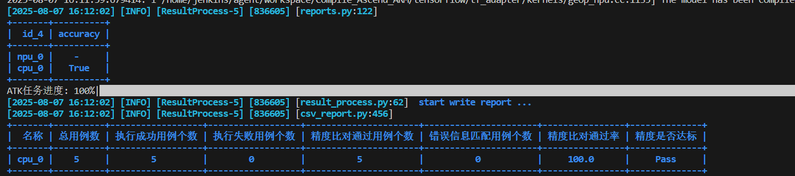
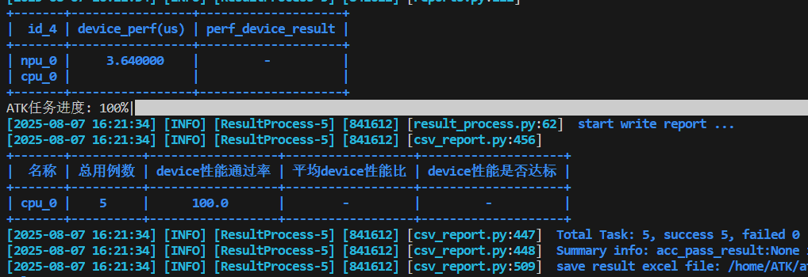

# Tensorflow算子测试指南

[toc]

---


# 环境准备

1、安装 TensorFlow 2.6

2、下载安装npu_device包：https://gitee.com/ascend/tensorflow/releases/tag/tfa_v0.0.36_8.1.RC1

3、安装ATK工具
```bash
pip3 install ATK*.whl
```


# 测试用例生成

用例生成yaml文件写法结构和执行命令请参考：[用例生成](../用例生成.md)
注意：Tensorflow算子需要修改**api**、**api_type**和**name**
三个参数，其中api_type参数在tensorflow测试场景下应默认写为function_tensorflow；如使用自定义api，api_type参数改为自定义api的注册器名称。

```yaml
api: tensorflow
api_type: function_tensorflow
name: tf.reduce_max
```

以tf.reduce_max为例，完整的用例生成yaml内容如下：

```yaml
api: tensorflow
api_type: function_tensorflow
version: v2.1
name: tf.reduce_max
aclnn_name: MaxDim
generate: reduce
standard:
  acc: single_bm
  perf: [ 1.0, 1.0 ]
extra_numbers: 0
inputs:
  - name: input
    type: tensor
    required: true
    dtypes:
      values: [ fp16, fp32 ]
    ranges:
      invalid:
        values: [ 'inf', '-inf' ]
        weights: [ 0.5, 0.5 ]
  - name: dim
    type: attr
    required: true
    dtypes:
      values: [ int ]
    ranges:
      valid:
        values: [ 1 , 0 ]
        weights: [ 0.85, 0.15 ]
      invalid:
        values: [ 1, 0 ]
        weights: [ 0.5, 0.5 ]
  - name: keepdim
    type: attr
    required: false
    dtypes:
      values: [ bool ]
    ranges:
      valid:
        values: [ true,  false ]
```

# 精度测试

精度执行命令和参数同Torch算子，可参考[任务执行](../任务执行.md)
以tf.reduce_max为例，执行命令如下:

```shell
atk node --backend npu --devices 0 node --backend cpu task all_tf.reduce_max.json --task accuracy
```

精度测试结果：



# 性能测试

性能执行命令和参数同Torch算子，可参考[任务执行](../任务执行.md)
以tf.reduce_max为例，执行命令如下:

```shell
atk node --backend npu --devices 0 node --backend cpu task all_tf.reduce_max.json --task performance_device
```

性能测试结果：


