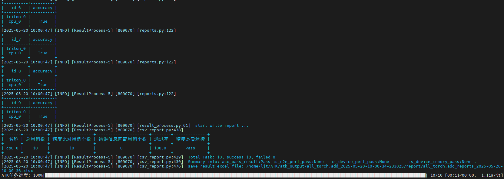
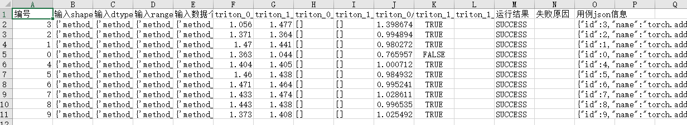
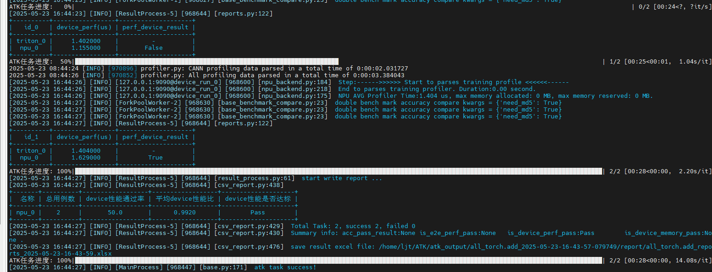

# Triton算子测试指南

[toc]

---

# 环境准备

1、完成Triton环境的配置

2、安装ATK工具
```
pip install ATK*.whl
```

# 测试用例生成

## 编写测试设计yaml

根据需要测试的算子输入参数信息，编写对应的测试设计yaml文件，详细参数说明可参考：[用例生成](../用例生成.md)

yaml中，与自定义相关的三个参数如下：

- `generate: generate_add`: 默认为`default`, 表示不需要参数约束, 如果需要参数约束, 则填对应自定义参数约束py脚本中`@GENERATOR_REGISTRY.register("generate_add")`的注册名称
- `api_type: function`: 默认为`function`，表示执行`eval(api_name)`, `api_name`为yaml文件中的`name`, 也可以自定义py脚本
- `triton_api_type: triton_add`: 必须填写, 表示triton kernel/api的自定义调用py脚本, 对应自定义脚本中`@register("triton_add")`的注册名称

triton接口的参数说明，请参考triton的官方链接：[https://triton-lang.org/main/index.html](https://triton-lang.org/main/index.html)

以add算子为例，add.yaml完整文件如下：

```
# add.yaml
api: pytorch
version: v2.1
name: torch.add
triton_name: test_general_add.triton_add
api_type: function
triton_api_type: triton_add
generate: generate_add
dtype_numbers: 700
standard:
  acc: single_bm
  perf: not_key
inputs:         
  - name:
    type: tensor
    required: true
    dtypes:
      values: [ fp32, fp16, bf16 ]
    ranges:
      valid:
        values: [ [-10,10], [-100,100] ]
      invalid:
        values: [ [-10,10], [-100,100] ]
    shapes:
      dim_numbers:
        values: [ 1, 2, 3, 4, 5 ]
      dim_values: 
        values: [ 1,2,3,4,5,7,8,11,15,16,17,22,23,25,27,255,256,257 ]
      max_length: 196608
  - name:
    type: tensor
    required: true
    dtypes:
      values: [ fp32, fp16, bf16 ]
    ranges:
      valid:
        values: [ [-10,10], [-100,100] ]
      invalid:
        values: [ [-10,10], [-100,100] ]
    shapes:
      dim_numbers:
        values: [ 1, 2, 3, 4, 5 ]
      dim_values: 
        values: [ 1,2,3,4,5,7,8,11,15,16,17,22,23,25,27,255,256,257 ]
      max_length: 196608
```

## 编写自定义参数约束

如果算子的输入参数之间存在约束，需要编写对应的参数约束脚本，具体方法请参考：[自定义规则约束](../用例生成.md#自定义规则约束)

以add算子为例，generate_add.py完整文件如下：

```python
# generate_add.py

import random
from atk.case_generator.generator.generate_types import GENERATOR_REGISTRY
from atk.case_generator.generator.base_generator import CaseGenerator
from atk.configs.case_config import CaseConfig


@GENERATOR_REGISTRY.register("generate_add")  # generate_add为注册的生成器名称，对应yaml中的generate参数
class ReduceGenerator(CaseGenerator):

    def after_case_config(self, case_config: CaseConfig) -> CaseConfig:
        '''
        用例参数约束修改入口
        :param case_config:  生成的用例信息，可能不满足参数间约束，导致用例无效
        :return: 返回修改后符合参数间约束关系的用例，需要用例保障用例有效
        '''
        case_config.inputs[1].shape = case_config.inputs[0].shape # 使得第二个输入shape与第一个输入shape一致, 可以进行相加
        case_config.inputs[1].shape = [1 if random.randint(0, 1) else shape_value for shape_value in case_config.inputs[1].shape] # 第二个输入shape随机某维度置1, 可以测试到广播机制
        return case_config
```

## 执行ATK工具生成测试用例

执行以下命令生成对应算子的泛化测试用例，其中`XXX.yaml`为测试设计yaml文件（必选），`XXX.py`为参数约束脚本（可选）

```
atk case -f XXX.yaml -p XXX.py

# 例：atk case -f add.yaml -p generate_add.py
```

# 自定义标杆适配

- 如果torch没有对应的标杆接口，请参考: [自定义API实现](../任务执行.md#自定义api执行方式)

- 如果torch有对应的标杆接口，可以通过设置yaml文件的`name: 接口名`和`api_type: function`调用标杆，例子如下：
```
# add.yaml
...
name: torch.add
api_type: function
...
```

`function.py`标杆的代码如下所示:

```python
# function.py
import torch

from atk.configs.dataset_config import InputDataset
from atk.tasks.api_execute import register
from atk.tasks.api_execute.base_api import BaseApi


@register("function")    # function 对应 yaml 文件中的 api_type
class FunctionApi(BaseApi):
    def __call__(self, input_data: InputDataset, with_output: bool = False):
        if not with_output:
            eval(self.api_name)(*input_data.args, **input_data.kwargs)   # self.api_name 对应 yaml 文件中的 name
            return
        output = eval(self.api_name)(*input_data.args, **input_data.kwargs)
        return output
```

如果我们需要实现一个`add + matmul`算子的自定义标杆，示例如下:

```python
# addmm.py
import torch

from atk.configs.dataset_config import InputDataset
from atk.tasks.api_execute import register
from atk.tasks.api_execute.base_api import BaseApi


@register("addmm")    # 对应 yaml 文件中的 api_type
class AddmmApi(BaseApi):
    def __call__(self, input_data: InputDataset, with_output: bool = False):
        # cpu 小算子拼接作为标杆
        if sef.device == "cpu":
            a = input_data.args[0]
            b = input_data.args[1]
            tmp = torch.matmul(a, b)
            c = input_data.args[2]
            output = torch.add(tmp, c)
        
        # npu 融合算子作为标杆
        elif sef.device == "npu":
            import torch_npu
            a = input_data.args[0]
            b = input_data.args[1]
            c = input_data.args[2]
            output = torch_npu.addmm(a, b, c)  
        return output
```


# 自定义api适配

目前执行Triton算子接口的调用，需要在自定义api中实现相应的代码。相应的Triton算子接口实现可以参考`triton_ascend`仓[https://gitcode.com/Ascend/triton-ascend](https://gitcode.com/Ascend/triton-ascend)中的ut测试脚本。

* 编写ATK的自定义api文件：在`__call__`函数中，实现Triton算子的的接口调用；

以下是适配`triton_add`算子的`triton_add.py`代码样例：

```python
# triton_add.py

from atk.configs.dataset_config import InputDataset
from atk.tasks.api_execute import register
from atk.tasks.api_execute.triton_base_api import TritonBaseApi


@register("triton_add")  # triton_add 对应 yaml 文件中的 triton_api_type
class TritonFunctionApi(TritonBaseApi): # 集成 基类TritonBaseApi 实现自定义的类
    def __call__(self, input_data: InputDataset, with_output: bool = False):
        # 第一步，读取 input_data 中的输入参数, 并构造 output 
        # 其中 input_data.args[-1] 为标杆的输出结果, 可以直接取用!
        x = input_data.args[0]
        y = input_data.args[1]
        z = x.clone()
        output = input_data.args[-1].to(x.dtype)
        
        # 第二步, 根据输入参数的shape等信息, 构造triton kernel函数所需要的其他tiling参数等
        shape = x.shape
        if len(shape) == 1:
            XB = 1
            xnumel = 1
            YB = 1
            ynumel = 1
            ZB = shape[0]
            znumel = shape[0]
        elif len(shape) == 2:
            XB = 1
            xnumel = 1
            YB = shape[0]
            ynumel = shape[0]
            ZB = shape[1]
            znumel = shape[1]
        else:
            XB = shape[0]
            xnumel = shape[0]
            YB = shape[1]
            ynumel = shape[1]
            ZB = shape[2]
            znumel = shape[2]

        grid = (1, 1, 1)
        if x.numel() * x.element_size() >= 8192:
            grid = (1, 1, ZB)
            ZB = 1
        
        # 第三步, 导入并调用 triton kernel 函数, 获取输出并返回
        # 其中包含triton kernel 函数(triton_add)的文件test_general_add.py，可以通过执行参数-tup传入
        from test_general_add import triton_add
        triton_add[grid](output, x, y, z, XB, YB, ZB, xnumel, ynumel, znumel)
 
        return output
```

# 精度测试

执行精度测试时，第一个节点设置为 `--backend triton`，第二个节点根据选取的标杆类型可设置`--backend npu`或者`--backend cpu`，执行任务选择`--task accuracy`。

关键参数设置：`-tup --triton_ut_path`，可选参数，表示包含triton kernel 函数(triton_add)的文件所在目录。
例如，测试的`triton_add`接口在`test_general_add.py`文件中，包含该文件的目录为`generalization_cases`，则需要传入参数`-tup ./generalization_cases`。

```
├── 📂generalization_cases
│   ├── 📄test_general_add.py
│   ├── 📄test_abs.py
│   ├── 📄test_broadcast.py
│   .....
```
一些现成的triton kernel文件, 可从triton-ascend仓下载：[generalization_cases](https://gitcode.com/Ascend/triton-ascend/blob/master/ascend/examples/generalization_cases)


其他执行参数的具体说明参考链接：[任务执行-参数说明](../任务执行.md#参数说明)
执行命令示例如下：

```
# CPU作为标杆
atk node --backend triton --devices 0 node --backend cpu task -c all_torch.add.json --task accuracy --triton_ut_path ./generalization_cases -p triton_add.py

# NPU作为标杆
atk node --backend triton --devices 0 node --backend npu --devices 0 task -c all_torch.add.json --task accuracy --triton_ut_path ./generalization_cases -p triton_add.py
```

如果需要和GPU进行比较，则需要在GPU节点上安装ATK工具，并启动ATK的服务，参考链接：[多机执行](../任务执行.md#多机在线执行)
然后执行如下测试命令：

```
# GPU作为标杆
atk node --backend triton --devices 0 node --backend gpu -h gpu环境的IP -p 环境端口号 --devices 0  -c all_torch.add.json --task accuracy --triton_ut_path ./generalization_cases -p triton_add.py
```

执行结果如下图所示：



# 性能测试

## 直接和标杆比较性能

执行性能测试时，节点参数设置与精度测试相同，执行任务选择`--task performance_device`，如果需要保存性能采集数据，则可以添加参数`--save_data profile`。
其他执行参数的具体说明参考：[任务执行-参数说明](../任务执行.md#参数说明)

命令示例如下：

```
atk node --backend triton --devices 0 node --backend npu --devices 0 task -c all_torch.add.json --task performance_device --triton_ut_path ./generalization_cases -p triton_add.py
```

**如果性能测试通过之后，将输出的excel报表，路径为`./atk_output/all_算子名_时间戳/report/all_算子名_reports_时间戳.xlsx`，保存到`ATK_CIDA`仓中。** 报表截图示例如下：



执行结果如下图所示：




## 导入基线性能进行比较

如果需要与其他cann版本或者是之前保存的基线性能数据进行比较，测试算子的性能是否存在劣化，执行命令如下：

1. 先保存基线的性能数据，执行命令如下：（如果`ATK_CIDA`仓中已有基线性能数据，可跳过这一步，直接进行第二步）

```bash
atk node --backend triton --devices 0 node --backend cpu --is_compare false  task -c ./result/torch.add/json/all_torch.add.json --task performance_device --triton_ut_path ./generalization_cases -e 10 -p triton_add.py
```

得到基线的性能数据excel文件`all_torch.add_reports_2025-05-27-19-47-45.xlsx`，并保存至`ATK_CIDA`仓。
执行结果如下：

```
+----------+-----------------+--------------------+
|   id_0   | device_perf(us) | perf_device_result |
+----------+-----------------+--------------------+
| triton_0 |     1.044000    |         -          |
+----------+-----------------+--------------------+
```

2. 导入步骤1中得到的基线性能数据excel文件（如果`ATK_CIDA`仓中已有基线性能数据，直接从仓上下载），进行算子性能测试。

```bash
atk node --backend triton --devices 0 node --backend cpu --is_compare False node --backend triton --devices 0 --bm_file 基线性能数据excel文件路径 task -c 用例json路径 --task performance_device --triton_ut_path triton的UT测试用例目录 -e 10

# 例：
atk node --backend triton --devices 0 node --backend cpu --is_compare False node --backend triton --devices 0 --bm_file all_torch.add_reports_2025-05-27-19-47-45.xlsx task -c ./result/torch.add/json/all_torch.add.json --task performance_device --triton_ut_path ./generalization_cases -e 10 -p triton_add.py
```

关键执行参数含义如下：

| 参数| 子参数 | 说明 |
| --- | --- | --- |
| node | --bm_file | 标杆/基线性能测试数据的excel文件路径，用于和已有性能数据比对 |

执行结果如下：

```
+----------+----------+------------------+------------------+--------------------+
|   名称   | 总用例数 | device性能通过率 | 平均device性能比 | device性能是否达标 |
+----------+----------+------------------+------------------+--------------------+
| triton_1 |    10    |       90.0       |      1.0171      |        Pass        |
+----------+----------+------------------+------------------+--------------------+
```
