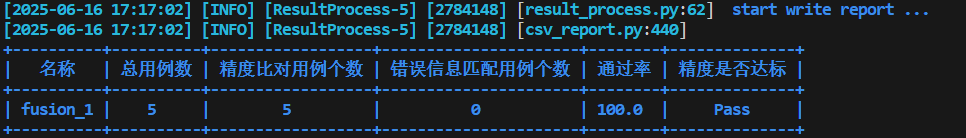
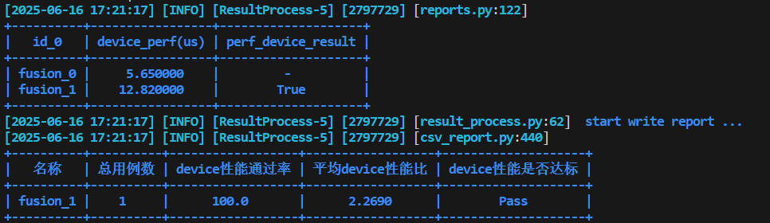

# 融合规则算子测试指南

[toc]

---

# 环境准备

1、安装tensorflow 2.6版本

2、安装ATK工具

# 测试用例生成

## 用例设计yaml

用例设计yaml文件的编写规范及自定义约束请参考: [自定义规则约束](../用例生成.md#自定义规则约束)

融合算子需在yaml中新增**fusion_mode**和**mode**两个参数

> fusion_mode：融合后输出的数据类型，该参数dtypes为string；
> mode：算子融合的不同规则，该参数dtypes为int，配合后续自定义API使用。

融合算子测试的精度标准设置为双标杆(cv_fused_double_benchmark):

```yaml
standard: 
    acc: cv_fused_double_benchmark
```

如果有对应的fusion自定义api，需要设置fusion_api_type参数，若不设置，工具会默认生成并使用fusion_function

```yaml
fusion_api_type: fusion_function
```

以MatMulBiasAddFusion算子为例，完整用例设计文件如下：

```yaml
# MatMulBiasAddFusionPass.yaml
api: pytorch
api_type: fusion_matmul_bias_add
version: v2.1
name: MatMulBiasAddFusionPass
dtype_numbers: 250
generate: ascend_generate_MatMulBiasAddFusionPass
standard:
  acc: cv_fused_double_benchmark
inputs:
  - name: TsA
    type: tensor
    required: true
    dtypes:
      values: [fp16, fp32]
    shapes:
      dim_numbers:
        values: [2]
      dim_values:
        values: [ 1, 7, 8, 9, 15, 16, 17, 19, 20, 21, 31, 32, 33, 63, 64, 65, 127, 128, 129, 255, 256, 257, 511, 512, 513, 1023, 1024, 1025, 2047, 2048, 2049, 4095, 4096, 4097, 8191, 8192, 8193, [ 1,1024 ], [ 1025,2048 ], [ 2049,3072 ], [ 3073,4096 ],[ 4097,5120 ],[ 5121,6144 ],[ 6145,7168 ],[ 7169,8192 ]]
      max_length: 1073741824
    ranges:
      valid:
        values: [[-1, 1]]
        random_types:
          - name: default
      invalid:
        values: [[-1, 1]]
  - name: TsB
    type: tensor
    required: true
    dtypes:
      values: [fp16, fp32]
    shapes:
      dim_numbers:
        values: [2]
      dim_values:
        values: [ 1, 7, 8, 9, 15, 16, 17, 19, 20, 21, 31, 32, 33, 63, 64, 65, 127, 128, 129, 255, 256, 257, 511, 512, 513, 1023, 1024, 1025, 2047, 2048, 2049, 4095, 4096, 4097, 8191, 8192, 8193, [ 1,1024 ], [ 1025,2048 ], [ 2049,3072 ], [ 3073,4096 ],[ 4097,5120 ],[ 5121,6144 ],[ 6145,7168 ],[ 7169,8192 ]]
      max_length: 1073741824
    ranges:
      valid:
        values: [[-1, 1]]
        random_types:
          - name: default
      invalid:
        values: [[-1, 1]]
  - name: bias
    type: tensor
    required: true
    dtypes:
      values: [fp16, fp32]
    shapes:
      dim_numbers:
        values: [1]
      dim_values:
        values: [ 1, 7, 8, 9, 15, 16, 17, 19, 20, 21, 31, 32, 33, 63, 64, 65, 127, 128, 129, 255, 256, 257, 511, 512, 513, 1023, 1024, 1025, 2047, 2048, 2049, 4095, 4096, 4097, 8191, 8192, 8193, [ 1,1024 ], [ 1025,2048 ], [ 2049,3072 ], [ 3073,4096 ],[ 4097,5120 ],[ 5121,6144 ],[ 6145,7168 ],[ 7169,8192 ]]
      max_length: 1073741824
    ranges:
      valid:
        values: [[-1, 1]]
        random_types:
          - name: default
      invalid:
        values: [[-1, 1]]
  # 融合算子新增的必要参数
  - name: fusion_mode
    type: attr
    required: true
    dtypes:
      values: [ string ]
    ranges:
      valid:
        values: [ 'fp16', 'fp32' ]
      invalid:
        values: [ 'fp16', 'fp32' ]
  # 融合算子新增的必要参数
  - name: mode
    type: attr
    required: true
    dtypes:
      values: [ int ]
    ranges:
      valid:
        values: [1,2,3,4]
      invalid:
        values: [1,2,3,4]
```

结合自定义约束文件，执行以下命令进行用例生成：

```shell
atk case -f MatMulBiasAddFusionPass.yaml -p ascend_generate_MatMulBiasAddFusionPass.py
```


# 自定义API实现

自定义API的编写规范请参考：[自定义API实现](../任务执行.md#自定义api执行方式)

写法迁移，以MatMulBiasAddFusionPass为例，只需要迁移gen_pb_and_data函数，主要分为6个步骤：

1. 获取输入tensor，转换成numpy格式
2. 获取输入mode参数
3. tensorflow图初始化过程，可直接移入自定义标杆call函数中
4. tensorflow图构建过程，去除冗余后放入get_graph_out函数中
5. tensorflow图计算过程，可直接移入自定义标杆call函数中
6. tensorflow图保存过程，这一步工具已集成实现，用户不用迁移
   

## call函数

1. 将输入torch.Tensor转换为numpy.array的形式，用于tensorflow计算图的输入
2. 通过mode参数选择不同的融合方式
3. 使用tensorflow构建融合后计算图，计算在cpu上的输出结果

以MatMulBiasAddFusionPass为例，自定义API如下：

```python
# MatMulBiasAddFusionPass自定义API
import tensorflow as tf

from atk.configs.dataset_config import InputDataset
from atk.tasks.api_execute import register
from atk.tasks.api_execute.base_api import BaseApi

@register("fusion_matmul_bias_add")
class FunctionFusionApi(BaseApi):
    def __call__(self, input_data: InputDataset, with_output: bool = False):
        outputs = None
        # 获取输入tensor
        TsA_tensor = self.torch_to_numpy(input_data.kwargs["TsA"])
        TsB_tensor = self.torch_to_numpy(input_data.kwargs["TsB"])
        bias_tensor = self.torch_to_numpy(input_data.kwargs["bias"])
        mode = input_data.kwargs["mode"]
        # 图初始化
        tf.compat.v1.disable_eager_execution()
        tf.compat.v1.reset_default_graph()
        # 图构建
        TsA, TsB, bias, out = self.get_graph_out(TsA_tensor, TsB_tensor, bias_tensor, mode=mode)

        feed_dict = {TsA:TsA_tensor, TsB:TsB_tensor, bias:bias_tensor}

        session_config = tf.compat.v1.ConfigProto(
            allow_soft_placement=True,
            log_device_placement=False)
        # 图计算
        with tf.compat.v1.Session(config=session_config) as sess:
            outputs = sess.run(out, feed_dict=feed_dict)

        return outputs

    def get_graph_out(self, *args, mode):
        TsA = tf.compat.v1.placeholder(args[0].dtype, shape=args[0].shape)
        TsB = tf.compat.v1.placeholder(args[1].dtype, shape=args[1].shape)
        bias = tf.compat.v1.placeholder(args[2].dtype, shape=args[2].shape)

        if mode == 1:
            out = tf.raw_ops.Add(x=tf.raw_ops.MatMul(a=TsA, b=TsB), y=bias)
        elif mode == 2:
            out = tf.raw_ops.BiasAdd(value=tf.raw_ops.MatMul(a=TsA, b=TsB), bias=bias)
        elif mode == 3:
            out = tf.raw_ops.Add(x=tf.raw_ops.BatchMatMulV2(x=TsA, y=TsB), y=bias)
        elif mode == 4:
            out = tf.raw_ops.BiasAdd(value=tf.raw_ops.BatchMatMulV2(x=TsA, y=TsB), bias=bias)

        return TsA, TsB, bias, out

    def torch_to_numpy(self, tensor):
        return tensor.detach().cpu().numpy()
```

# 精度测试

融合算子精度标准为`cv_fused_double_benchmark`，说明可参考：[精度标准说明](../结果分析.md#精度标准说明)

执行以下命令进行精度测试：

```shell
atk node --backend fusion --devices 0 node --backend fusion --devices 0 --fusion_flag True task -c all_MatMulBiasAddFusionPass.json -p executor_MatMulBiasAddFusionPass.py --task accuracy
```

其中第一个节点fusion为在npu上待测融合后算子，第二个节点fusion为融合前算子，fusion_flag为True时表示融合开关关闭。
如果该算子融合开关可以关闭并且需要进行融合前后的精度比对，必须在第二个节点设置--fusion_flag
True，否则第二个节点设置为cpu，进行cpu和npu的融合后精度比对，执行命令如下：

```shell
atk node --backend fusion --devices 0 node --backend cpu task -c all_MatMulBiasAddFusionPass.json -p executor_MatMulBiasAddFusionPass.py --task accuracy
```

精度结果参考如下：



# 性能测试

融合算子支持performance_device进行性能测试，比对融合前后的性能，执行命令如下：

```shell
atk node --backend fusion --devices 0 node --backend fusion --devices 0 --fusion_flag True task -c all_MatMulBiasAddFusionPass.json -p executor_MatMulBiasAddFusionPass.py --task performance_device
```

性能结果参考如下：



# 特殊场景

## 场景一：输入是list[array]

用户需要重写自定义FusionAPI，将输入转换为list形式，典型算子：AddNFusion

```python
@register("fusion_add_n")
class FunctionFusionApi(BaseApi):
    def __call__(self, input_data: InputDataset, with_output: bool = False):
        output = None
        x_tensor = self.torch_to_numpy(input_data.kwargs["x"])
	...
	feed_dict = {x_list[i]: x_tensor for i in range(n)}
	...

@register("fusion_function_add")
class FusionFunctionApi(FusionBaseApi):
    def init_by_input_data(self, input_data: InputDataset):
        input_args, mode, fusion_mode = super().init_by_input_data(input_data)
        input_args[0] = [input_args[0]] * input_data.kwargs['n']

        return input_args, mode, fusion_mode
```

## 场景二：有某一个/几个输入在计算时不需要

用户需要重写重写自定义FusionAPI，将不需要的输入删除，典型算子：PadFusion

```python
@register("fusion_pad")
class FunctionFusionApi(BaseApi):
    def __call__(self, input_data: InputDataset, with_output: bool = False):
        outputs = None
        x_tensor = self.torch_to_numpy(input_data.kwargs["x"])
        paddings_tensor = self.torch_to_numpy(input_data.kwargs["paddings"])
	...
	x, out = self.get_graph_out(x_tensor, paddings_tensor, mode=mode)
	...

@register("fusion_function_pad")
class FusionFunctionApi(FusionBaseApi):
    def init_by_input_data(self, input_data: InputDataset):
        input_args, mode, fusion_mode = super().init_by_input_data(input_data)
        input_args.pop(1)

        return input_args, mode, fusion_mode
```
