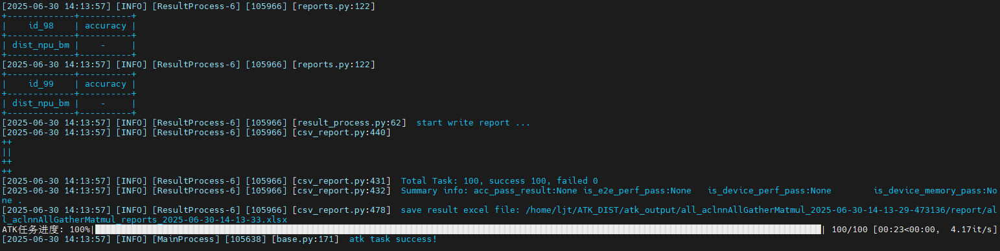
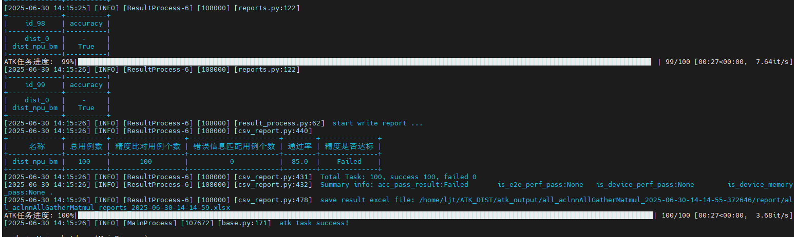

# 通信&通算融合算子测试指南

[toc]

---


# 环境准备

1、准备一个多卡的NPU环境（至少2卡）

2、安装ATK工具
```
pip install ATK*.whl
```

# 测试用例生成

## 编写测试设计yaml

根据需要测试的算子输入参数信息，编写对应的测试设计yaml文件，详细参数说明可参考链接：[用例生成](../用例生成.md)

yaml中的`通信算子的自定义api`关键参数如下：

```yaml
dist_api_type: dist_function # 表示自定义的通信算子的接口调用方式，跟自定义文件中的注册名字对应，使用方法与api_type相同
```

以`aclnnAllGatherMatmul`通算融合算子为例，`aclnnAllGatherMatmul.yaml`文件如下：

```yaml
version: v2.1
name: aclnnAllGatherMatmul
api: pytorch
api_type: function
dist_api_type: dist_function # 表示自定义的通信算子的接口调用方式，跟自定义文件中的注册名字对应，使用方法与api_type相同
generate: generate_matmul # 表示自定义参数约束的文件
dtype_numbers: 700
backward: false
standard:
    acc: single_bm
    perf: not_key
inputs:
  - name: 
    type: tensor
    required: true
    dtypes:
      values: [ bf16, fp16 ]
    ranges:
      valid:
        values: [ [-5, 5] ]
      invalid:
        values: [ [-5, 5] ]
    shapes:
      dim_numbers:
        values: [2]
      dim_values:
        values: [1920, 5120, 8192, 10240, 16384]
  - name: 
    type: tensor
    required: true
    dtypes:
      values: [ bf16, fp16 ]
    ranges:
      valid:
        values: [ [-5, 5] ]
      invalid:
        values: [ [-5, 5] ]
    shapes:
      dim_numbers:
        values: [2]
      dim_values:
        values: [1920, 5120, 8192, 10240, 16384]

```

## 编写自定义参数约束

如果算子的输入参数之间存在约束，需要编写对应的参数约束脚本，具体方法请参考链接：[自定义规则约束](../用例生成.md#自定义规则约束)

以`aclnnAllGatherMatmul`算子为例，`generate_matmul.py`完整文件如下：

```python

from atk.case_generator.generator.generate_types import GENERATOR_REGISTRY
from atk.case_generator.generator.base_generator import CaseGenerator
from atk.configs.case_config import CaseConfig


@GENERATOR_REGISTRY.register("generate_matmul")  # generate_matmul 为注册的生成器名称，对应yaml中的generate参数
class ReduceGenerator(CaseGenerator):

    def after_case_config(self, case_config: CaseConfig) -> CaseConfig:
        '''
        用例参数约束修改入口
        :param case_config:  生成的用例信息，可能不满足参数间约束，导致用例无效
        :return: 返回修改后符合参数间约束关系的用例，需要用例保障用例有效

        matmul约束：
        第一个tensor的最后一维，需要与第二个tensor的第一维相同
        '''
        case_config.inputs[1].shape[0] = case_config.inputs[0].shape[-1]
        case_config.inputs[1].dtype = case_config.inputs[0].dtype
        return case_config
```

## 执行ATK工具生成测试用例

执行以下命令生成对应算子的泛化测试用例，其中`XXX.yaml`为测试设计yaml文件（必选），`XXX.py`为参数约束脚本（可选）

```shell
atk case -f XXX.yaml -p XXX.py

# 样例
atk case -f aclnnAllGatherMatmul.yaml -p generate_matmul.py
```

# 自定义api适配（重要！！！）

* 编写ATK的自定义api文件：
  1、编写一个自定义类，继承ATK中的基类`BaseApi`，然后在`__init__`中获取`dist_task_info`;
  
  ```python
  # dist_task_info为一个字典，包括如下信息可以获取：
  dist_task_info = {
                   "rank": device_id, # npu卡号
                   "world_size": len(node_info.devices), # world_size
                   "is_bm": node_info.is_bm, # 是否执行标杆
                   "dist_backend": node_info.dist_backend # 通信域创建参数，hccl/gloo
               }
  ```
  
  2、如果需要对输入数据进行预处理，在`init_by_input_data`中进行数据预处理；
  3、在`__call__`函数中，实现**通信算子**和**标杆算子**的接口调用，其中`is_bm`为`True`分支下执行标杆的接口调用，`is_bm`不为`True`的分支下执行通信算子的接口调用；
  4、分别返回**通信算子**和**标杆算子**执行之后的输出结果。

- `torch_npu.npu_all_gather_base_mm`算子测试，完整的自定义api脚本`dist_function.py`如下：

```python
import torch
import torch.distributed as dist
try:
   import torch_npu
except ImportError:
   pass

from atk.configs.dataset_config import InputDataset
from atk.tasks.api_execute import register
from atk.tasks.api_execute.base_api import BaseApi

@register("dist_function")
class DistFunctionApi(BaseApi):
    def __init__(self, task_result):
        super(DistFunctionApi, self).__init__(task_result)
        self.dist_task_info = task_result.dist_task_info

    def __call__(self, input_data: InputDataset, with_output: bool = False):
        rank_id = self.dist_task_info.rank
        world_size = self.dist_task_info.world_size
        input_chunk = input_data.args[0]
        weight_chunk = input_data.args[1]

        if self.dist_task_info.is_bm:
            # NPU 小算子级联标杆
            all_gather_list = [torch.zeros_like(input_chunk) for _ in range(world_size)]
            dist.all_gather(all_gather_list, input_chunk)
            all_gather_out = torch.cat(all_gather_list, dim=0)
            output = torch.matmul(all_gather_out, weight_chunk)
            return output
        else:
            # 通算融合算子
            if dist.is_available():
                hcomm_info = DistFunctionApi.get_hcomm_info(rank_id)
            output = torch_npu.npu_all_gather_base_mm(input_chunk, weight_chunk,
                                                      hcomm_info, world_size, gather_output=False)
            return output[0]
   
    @staticmethod
    def get_hcomm_info(rank_id):
        from torch.distributed.distributed_c10d import _get_default_group
        default_pg = _get_default_group()
        if torch.__version__ > '2.0.1':
            backend_obj = getattr(default_pg, "_get_backend", None)
            hcomm_info = backend_obj(torch.device("npu")).get_hccl_comm_name(rank_id)
        else:
            hcomm_info = default_pg.get_hccl_comm_name(rank_id)
        return hcomm_info
	
    def init_by_input_data(self, input_data: InputDataset):
        rank_id = self.dist_task_info.rank
        world_size = self.dist_task_info.world_size
        device = "npu:" + str(rank_id)

        chunks_input = torch.chunk(input_data.args[0].cpu(), chunks=world_size, dim=-1)
        chunks_weight = torch.chunk(input_data.args[1].cpu(), chunks=world_size, dim=0)

        input_data.args[0] = chunks_input[rank_id].to(device)
        input_data.args[1] = chunks_weight[rank_id].to(device)

        if self.device == "pyaclnn" and dist.is_available():
            input_data.args[3] = DistFunctionApi.get_hcomm_info(rank_id)
```

# 精度测试

执行精度测试时，由于NPU标杆的小算子级联也需要创建通信域，因此需要执行两步命令进行测试。

## 第一步：执行标杆，保存输出数据

通信算子测试常用的参数说明：（完整的执行参数说明参考链接：[任务执行-参数说明](../任务执行.md#参数说明)

| 配置项             | 说明                                              | 示例                                                           |
| --- | --- |--------------------------------------------------------------|
| -b, --backend            | **必填**，  ['npu', 'cpu', 'gpu','pyaclnn','aclnn','dist']，及自定义后端设备，指明对应的后端执行节点                    | `atk node --backend dist`                                    |
| -n, --name               | 设备名称                                          | `atk node --backend dist --name npu_bm`                      |
| --devices            | 非cpu**必填**，驱动编号，指定当前任务执行的device          | `atk node --backend npu --devices 0,1`                       |
|  --dist_backend            | 通信域类型                                        | 不传参默认为`hccl`，目前支持`--dist_backend hccl`和`--dist_backend gloo` |
|  --is_bm     | 区分是否执行标杆的参数                                  | 默认为`False`，如果需要执行标杆中的接口调用，则传`--is_bm True`                   |
| --is_dist   | backend为pyaclnn时通信算子的选项，区分普通aclnn算子和通信aclnn算子

节点的类型设置为 `--backend dist`，标杆的设备名称需要指定`--name npu_bm`和第二步一致，执行任务选择`--task accuracy`。
完整的执行命令如下：

```shell
# 执行NPU小算子级联标杆
atk node --backend dist --name npu_bm --devices 0,1 --dist_backend hccl --is_bm true  task -c 用例json文件路径 --task accuracy --save_data output -mt 1

# 样例
atk node --backend dist --name npu_bm --devices 0,1 --dist_backend hccl --is_bm true  task -c ./distribute/allgather.json --task accuracy --save_data output -mt 1
```

执行结果如下图所示：(因为没有执行精度比对，所以没有比对的报表)


## 第二步：传入标杆结果，执行精度比对测试

获取第一步中执行的输出保存目录“xxx/output”，执行通算融合算子的接口并和第一步保存的标杆输出进行精度比对测试；
完整的执行命令如下：

```shell
# 传入标杆数据，执行精度比较
atk node --backend dist --task accuracy --devices 0,1 node --backend dist --name npu_bm --devices 0,1 --task accuracy_load --output_path 标杆输出保存目录 task -c 用例json文件路径 -mt 1

# api算子样例
atk node --backend dist --task accuracy --devices 0,1 node --backend dist --name npu_bm --devices 0,1 --task accuracy_load --output_path /home/ljt/ATK_DIST/atk_output/allgather_2025-06-27-15-49-18-591795/output/  task -c ./distribute/allgather.json -mt 1
# aclnn算子样例
atk node --backend pyaclnn --is_dist true --task accuracy --devices 0,1 node --backend dist --name npu_bm --devices 0,1 --task accuracy_load --output_path /home/ljt/ATK_DIST/atk_output/allgather_2025-06-27-15-49-18-591795/output/  task -c ./distribute/allgather.json -mt 1
```

执行结果如下图所示：（包含精度比对的结果）



# 性能测试

## 第一步：执行标杆，保存性能结果

```shell
atk node --backend dist --name npu_bm --devices 0,1 --dist_backend hccl --is_bm true  task -c 用例json文件路径 --task performance_device -mt 1
```

得到excel文件，假如保存到路径output_test/xxxx.xlsx

## 第二步：传入标杆性能结果，执行性能比对测试

将标杆算子性能数据作为基线，进行通算融合算子性能比对测试。

```bash
atk node --backend dist --devices 0,1  node --backend cpu --is_compare False --bm_file output_test/xxxx.xlsx task -c result/torch.max/json/all_torch.max.json --task performance_device -mt 1
```

```shell
export RANK_TABLE_FILE=/path/to/ranktablefile
```

上述步骤完成后，即可运行标杆算子用于验证。

## 精度比对

在多机通算测试场景中，用户需要在 **node.yaml** 中指定参与通信的机器，设备。示例如下：

```yaml
nodes:
   - backend: dist
     name: bm
     task: ['accuracy']
     devices: [0]
     remote_devices:
       - addr: 80.5.5.141:9090
         devices: [0]
       - addr: 80.5.5.142:9090
         devices: [0]
       - addr: 80.5.5.143:9090
         devices: [0]
     master_ip: 80.5.5.140
     master_port: 6791
     dist_backend: hccl
     is_bm: true
```

配置节点时需要新增如下参数：

| 名称             | 说明                                                                                                                                                                                                                                                                                                                                                                                                                                                                                       |
|----------------| --- |
| remote_devices | 配置远端的设备信息，需要指定机器的IP地址和机器上的卡号                                                                                                                                                                                                                                                                                                                                                                                                                  |
| master_ip      |  主节点 IP 地址                                                                                                                                                                                                                                                                                                                                                                                                                                                                                             |
| master_port    | 主节点端口号

remote_devices 中可指定若干个参与通信的机器，指定每个机器时包含如下参数：

| 名称      | 说明                                                                                                                                                                                                                                                                                                                                                                                                                                                                                       |
|---------| --- |
| addr    |  用于通信的机器地址(IP:port)，该地址用于和 ATK server 通信，端口号应为 ATK server 占用端口                                                                                                                                                                                                                                                                                                                                                                                                           |
| devices |  机器上的设备id

示例 **node.yaml** 文件定义了四机一卡的通算测试，接下来可以通过以下步骤运行测试：

### 在远端服务器上运行ATK server

```shell
atk server --devices 0
```

### 在本地执行算子

```shell
atk task -n node.yaml -c result/aclnnAllGatherMatmul/json/all_aclnnAllGatherMatmul.json --save_data output -mt 1
```

### 在远端服务器上重新启动 ATK server（暂时需要）

```shell
pkill -9 atk
atk server --devices 0
```

在进行精度比对任务时，用户需要先运行标杆，再导入标杆结果进行比对。
标杆执行部分可参考上述示例，其中 `node` 参数指定 `is_bm: true` ，以运行自定义api 中的标杆部分。
运行完后，假设算子输出所存路径为 `/home/ATK/atk_output/all_aclnnAllGatherMatmul_2025-11-06-08-41-31-555602/output`
则可配置如下 **node_compare.yaml** 进行精度比对:

```yaml
nodes:   
   - backend: dist
     task: ['accuracy']
     devices: [0]
     remote_devices: 
        - addr: 80.5.5.141:9090
          devices: [0]
     master_ip: 80.5.5.140
     master_port: 6791
     dist_backend: hccl
     is_bm: false
   - backend: dist
     name: bm
     task: ['accuracy_load']
     devices: [0]
     remote_devices: 
        - addr: 80.5.5.141:9090
          devices: [0]
     master_ip: 80.5.5.140
     master_port: 6791
     dist_backend: hccl
     is_bm: true
     output_path: /home/ATK/atk_output/all_aclnnAllGatherMatmul_2025-11-06-08-41-31-555602/output
```

运行步骤和示例类似：

```shell
atk server --devices 0
atk task -n node_compare.yaml -c result/aclnnAllGatherMatmul/json/all_aclnnAllGatherMatmul.json -mt 1
```

## 性能比对

在性能比对时，同样需要先运行标杆，再导入标杆性能数据进行比对。
标杆运行可参照如下配置：

```yaml
nodes:
   - backend: dist
     name: perf
     task: ['performance_device']
     devices: [0]
     remote_devices: 
        - addr: 80.5.5.141:9090
          devices: [0]
     master_ip: 80.5.5.140
     master_port: 6791
     dist_backend: hccl
     is_bm: true
```

运行后，假设结果报表文件存放路径为 `/home/ATK/all_aclnnAllGatherMatmul_2025-11-06-09-48-13-743598/report/all_aclnnAllGatherMatmul_reports_2025-11-06-09-48-16.xlsx`
在进行性能比对时导入上述结果报表文件即可：

```yaml
nodes:
   - backend: dist
     task: ['performance_device']
     devices: [0]
     remote_devices: 
        - addr: 80.5.5.141:9090
          devices: [0]
     master_ip: 80.5.5.140
     master_port: 6791
     dist_backend: hccl
     is_bm: false
   - backend: dist
     name: perf
     task: ['performance_device']
     devices: [0]
     remote_devices:
        - addr: 80.5.5.141:9090
          devices: [0]
     master_ip: 80.5.5.140
     master_port: 6791
     dist_backend: hccl
     is_bm: true
     is_compare: true
     bm_file: /home/ATK/all_aclnnAllGatherMatmul_2025-11-06-09-48-13-743598/report/all_aclnnAllGatherMatmul_reports_2025-11-06-09-48-16.xlsx
```
