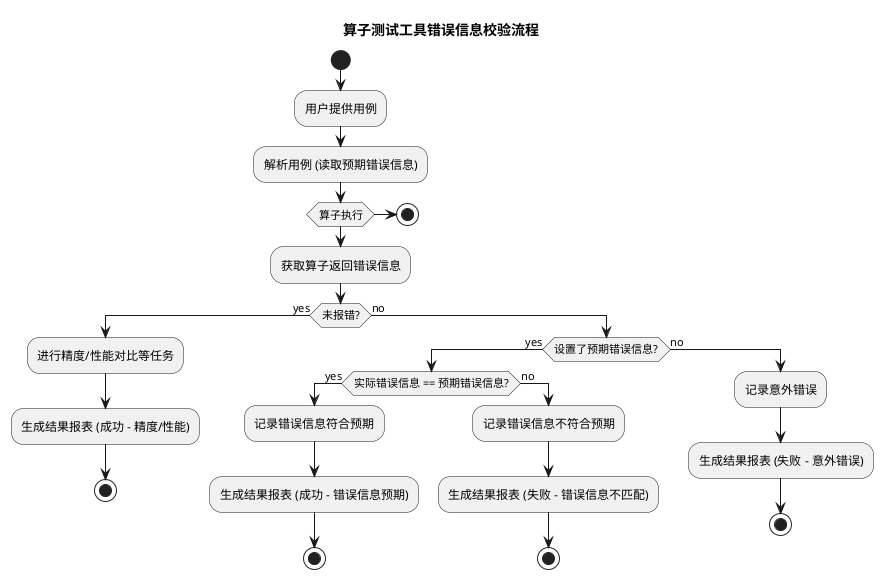

# 用例生成

[toc]

---

# 简介
> 本文档介绍通过atk工具来生成泛化测试用例，包含用例设计和规则约束。用例设计实现了算子输入的定义，规则约束则实现了输入间的约束关系。

用例生成执行命令如下：

```
atk case -f 算子用例设计.yaml -p 自定义参数约束脚本.py
```

`atk case`为atk工具的用例生成模块，可选参数如下：

| 配置项                  | 说明                                                                   | 示例                                              |
|----------------------|----------------------------------------------------------------------|-------------------------------------------------|
| -f, --case_file      | 必填项，填写用例设计文件路径，yaml格式                                                | `atk case -f op_max.yaml`                       |
| -p, --plugin_path    | 可选项，填写自定义用例生成规则文件路径，可以是文件路径、也可以是文件夹路径                                | `atk case -f op_max.yaml -p generate_reduce.py` |
| -s, --seed           | 随机种子，默认为：1234                                                        |                                                 |
| -l, --log            | 可选项，设置日志级别， 包含["debug", "info", "warn", "error", "fatal"]            | `atk case -f op_max.yaml -l info`               |
| -dt, --dtype_numbers | 可选项，设置每个dtype的数目,默认以yaml文件中的dtype_numbers为准, 设置后以该命令参数为准, 任意非负整数     | `atk case -f op_max.yaml -dt 700 `              |
| -en, --extra_numbers | 可选项，设置边界用例的数目,默认以yaml文件中的extra_numbers为准, 设置后以该命令参数为准, 可为'all'或非负整数" | `atk case -f op_max.yaml -en all `              |
| -df, --dtype_filter  | 可选项，滤除不需要的数据类型，使用示例: -df bf16,fp16                                   | `atk case -f op_max.yaml -df bf16,fp16 `        |
| -ps, --perf_standard | 可选项，自定义性能标准, 需传入两个值(逗号隔开), 第一个值表示所有用例的平均性能比阈值, 第二个值表示单用例的性能比阈值       | `atk case -f op_max.yaml -ps 1.0,2.0 `          |

# 算子用例设计

> 若用例输入之前相互是独立的，在本节实现用例设计后便可进行用例生成

`op_max.yaml`为算子的用例设计文件，如下所示：

```yaml
# op_max.yaml
api: pytorch
api_type: function
version: v2.1
name: torch.max
aclnn_name: MaxDim
dtype_numbers: 200
extra_numbers: all
compute_times: null
expected_error_msg: null
generate: default
backward: false
standard:
    acc: single_bm
    perf: not_key
size_distributions:
  - values: [[0, 16.0]]
    ratio: 0.7
  - values: [[32.0,1024.0]]
    ratio: 0.3
inputs:
  - name: input
    type: tensor
    required: true
    dtypes:
      values: [ fp32, fp16 ]
    ranges:
      valid:
        values: [ [-5, 5] ]
      invalid:
        values: [ [-5, 5] ]
    shapes:
      dim_numbers:
        values: [1, 2, 3, 4, 5, 6, 7, 8]
      max_length: 4294967295
    boundary:
      has_empty: true
      has_infnan: true
      has_scalar: true
      has_upper_border: true
      has_lower_border: true
  - name: dim
    type: attr
    required: true
    dtypes:
      values: [ int ]
    ranges:
      valid:
        values: [ [-5, 5] ]
      invalid:
        values: [ [-5, 5] ]
  - name: keepdim
    type: attr
    required: false
    dtypes:
      values: [ bool ]
    ranges:
      valid:
        values: [ true,  false ]
        weights: [ 0.5, 0.5 ]

# 其他输入参数
# tensor_input:
# method_inputs:
# outputs:

# tuple_numbers使用示例
   # - name: padding
   #   type: attrs
   #   required: true
   #   tuple_numbers:
   #     values: [ 6 ]
   #   dtypes:
   #     values: [ int ]
   #   ranges:
   #     valid:
   #       values: [ 1, 7, 8, 9, 15, 16, 17, 19, 20, 21, 255, 256, 257, 13107, [ 1,1024 ] ]
   #     invalid:
   #       values: [["-inf"], ["inf"]]
```

## 用例设计参数说明

用例设计文件中各个参数的含义如下：

| 名称               | 说明                                                                                                                                                                                                                                                                                                                                                                                                                          |
| ------------------ |-----------------------------------------------------------------------------------------------------------------------------------------------------------------------------------------------------------------------------------------------------------------------------------------------------------------------------------------------------------------------------------------------------------------------------|
| api                | 预留参数                                                                                                                                                                                                                                                                                                                                                                                                                        |
| api_type           | 执行后端为npu/cpu/gpu时会执行该逻辑，如值为function时会通过torch方法调用算子，调用的名称即为**name**字段的值。<br>在特定情况下需用户自定该实现逻辑，可通过自定文件实现，并在用例执行时将该文件路径作为命令行的输入，同时将该字段修改为自定义文件中注册器的名称，具体可参考[自定义API实现](任务执行.md#自定义API执行方式)                                                                                                                                                                                                                                       |
| aclnn_api_type     | 仅aclnn算子需要，需要用户自定义实现，用法同api_type                                                                                                                                                                                                                                                                                                                                                                                            |
| triton_api_type    | 仅triton算子需要，需要用户自定义实现，用法同api_type                                                                                                                                                                                                                                                                                                                                                                                           |
| fusion_api_type    | 仅融合算子需要，需要用户自定义实现，用法同api_type                                                                                                                                                                                                                                                                                                                                                                                               |
| version            | 预留参数                                                                                                                                                                                                                                                                                                                                                                                                                        |
| name               | 在npu/cpu节点执行调用算子的名称，如name字段为torch.max时，标杆调用方式为torch.max()                                                                                                                                                                                                                                                                                                                                                                   |
| aclnn_name         | 通过Pyaclnn执行算子的名称，如MaxDim；对应对执行aclnnMaxDim和aclnnMaxDimGetWorkspaceSize                                                                                                                                                                                                                                                                                                                                                       |
| dtype_numbers      | 每个数据类型生成用例数量，默认为700                                                                                                                                                                                                                                                                                                                                                                                                         |
| extra_numbers      | 默认为0，表示不生成特殊用例。extra_numbers为`all`时，表示遍历生成所有特殊用例。只有当extra_numbers指定为正整数或者`all`时才能生成特殊用例                                                                                                                                                                                                                                                                                                                                     |
| compute_times      | 默认为空，可设置为整数常量，在生成用例时，用例的计算次数属性会等于此常量，可用于需要根据计算次数决定阈值的场景（如单标杆比对）                                                                                                                                                                                                                                                                                                                                                             |
| expected_error_msg | 默认为空，表示无期望报错，若填写字符串，算子报错时则会在报错信息中匹配期望报错，若匹配成功，则视为该条用例通过，否则视为不通过，但无论是否通过，算子报错后都不再会进行原task流程                                                                                                                                                                                                                                                                                                                                  |
| generate           | 数据生成的规则，用于处理输入数据间的依赖关系，该处填default，默认没有依赖。<br>依赖规则可通过自定文件实现，并在用例生成时将该文件路径作为命令行的输入，同时将该字段修改为自定义文件中注册器的名称，具体可参考**2.2节参数约束**                                                                                                                                                                                                                                                                                                    |
| backward           | 用例级别的back参数，表示是否走反向计算流程，默认为false。当为true时需搭配输入参数级别的backward参数使用（因为不同输入参数可能反向的情况不同）。                                                                                                                                                                                                                                                                                                                                          |      
| standard           | acc表示精度标准，默认为`single_bm`，其他精度标准可参考[精度标准说明](结果分析.md#精度标准说明)；perf表示性能标准，默认为`not_key`，也可以填写为`[x, y]`，`x`表示所有用例的平均性能比阈值，`y`表示单用例的性能比阈值，如`[1.0, 1.0]`                                                                                                                                                                                                                                                                            |     
| size_distributions | 默认不启用， 规定由泛化用例生成的输入数据的大小范围（单位MB），以及该范围的输入数据个数在总个数中所占比例（不统计特殊用例）。<br>该需求在生成用例时可能无法满足，会产生相应的Warning信息，需注意查看。                                                                                                                                                                                                                                                                                                                  |               
| inputs             | 算子的输入参数信息，输入顺序为参数的位置信息                                                                                                                                                                                                                                                                                                                                                                                                      |
| tensor_input       | 	当api_type为tensor时，需要通过该参数来配置调用API的输入Tensor数据，其参数说明与inputs一致；<br>若此时需要自定义generator，tensor_input为after_case里index=0的输入数据，随后inputs再按顺序输入after_input_config函数                                                                                                                                                                                                                                                                  |            
| method_inputs      | 当api_type为method时，需要通过该参数来配置调用API的输入数据，其参数说明与inputs一致；若此时需要自定义generator，method_inputs、inputs分别按顺序输入after_input_config函数                                                                                                                                                                                                                                                                                                     |                                                                                                                                                                                                                                                                                    
| outputs            | 参数inputs的所有输入中，输出结果所在的位置/关键字，用户指定的api_type文件会读入该位置/关键字，并作为`self.output`以便用户使用；<br>当用户使用的api_type为function或`graph_function`时：<br>**None**表示输出结果为默认返回值结果，如output=torch.max()，默认输出结果为output<br>**int**表示输出结果为此位置参数的结果，torch.foreach_add(input1, input2)，值为0表示输出结果为input1<br>**str**表示输出结果在参数名称name上的结果，torch.foreach_add(input=[1,2,3], dim=1)，值为input表示输出结果为参数input的返回值 <br>当用户使用的api_type为自定义api_type时，会作为self.output，方便用户使用 |

## 算子输入设计参数说明

inputs表示算子的输入，其子参数的说明如下：

| 名称            | 说明                                                                                                                                                  |
|---------------|-----------------------------------------------------------------------------------------------------------------------------------------------------|
| name          | 参数名称，该参数为位置参数，需要按照标杆算子的的输入顺序填写                                                                                                                      |
| type          | 参数类型，可选值为[tensor\tensors\tensor_tuple\scalar\scalars\scalar_tuple\attr\attrs\attr_tuple]                                                            |
| required      | 预留参数                                                                                                                                                |
| backward      | 当用例级别的backward为True时，该输入级的backward参数才会生效，并在反向执行时，根据各个输入的backward参数设置其`requires_grad`，默认为True。注意：只有tensor和tensor list才能被设置requires_grad，其他类型的参数无法生效。 |
| dtypes        | 数据类型，不同参数类型支持的数据类型也不一致，其中tensor参数支持[fp64,int64,fp32,int32,hf32,bf16,fp16,int16,int8,uint8,bool]                                                     |
| shapes        | dim_numbers表示生成数据的可选维度，dim_values表示生成数据每一维度大小的可选范围，可通过weights参数设置可选范围，max_length表示当前输入的最大元素个数                                                       |
| ranges        | 设置输入数据取值的可选范围，可设置在valid中，异常值可设置在invalid中，现invalid设置的值不排除生成，和valid设置的值同样进行生成                                                                         |
| tuple_numbers | 当输入是序列数据（list、tuple）时，用于控制输入的序列长度的取值范围，至此的参数类型有：[tensors\tensor_tuple\scalars\scalar_tuple\attrs\attr_tuple]                                       |
| boundary      | 当输入的type为tensor\tensors\tensor_tuple时，子参数均为True，表示生成所有边界用例，当输入的type为其他时，不存在boundary参数。且仅在extra_numbers为正整数或者`all`时生效            |
| align_32B     | bool类型，align_32B为True时生成每种dtype的用例32B对齐与非对齐各一半                                                 |

boundary边界用例子参数及其说明如下：

| 参数名称             | 含义             | 说明                                |
|------------------|----------------|-----------------------------------|
| has_empty        | 空tensor        | shape中有一个维度为0的tensor              |
| has_infnan       | 全infnan tensor | 输入为inf/nan/-inf/[-inf,inf]的tensor |
| has_scalar       | 标量tensor       | shape为[]的tensor                   |
| has_upper_border | 上边界tensor      | shape的某个维度为2**31+1，其余维度都为1的tensor |
| has_lower_border | 下边界tensor      | shape的每个维度都为1的tensor              |

**ranges关键字说明如下：**

ranges参数中目前支持了4个关键字，包括`"max_value", "min_value", "positive_tiny", "negative_tiny"`，用户在ranges.valid或ranges.invalid可以使用这4个参数用于方便的表示对应dtype下的最大值、最小值、正最小量和负最小量。
例如，

- 当dtype为fp16时，最大值、最小值、正最小量和负最小量分别为65504.0，-65504.0，6.103515625e-05，-6.103515625e-05；
- 当dtype为fp32时，最大值、最小值、正最小量和负最小量分别为3.4028235e+38，-3.4028235e+38，1.1754943508e-38，-1.1754943508e-38；

具体的使用方式为，在ranges.valid或ranges.invalid的list中，使用关键字作为list的元素，又或者作为区间的端点。如["max_value", [-1, "positive_tiny"]]

由于bool和uint8类型的数据不存在负最小量，因此在用例生成时，会自动规避此类情况，当用户指定的data range和dtype只能组合出此类情况时会报错。

- 当用例输入数据类型type为 scalar, scalars, scalar_tuple, attr, attrs, attr_tuple 时，生成泛化用例的 range_values 为 values表示范围中的某个确定值。
- 当type为tensor, tensors, tensor_tuple 时， 生成泛化用例时 range_values 取 values 列表中的单个元素（可能为区间或单个值）。

## 输入数据支持的数据类型说明

### 默认支持的参数类型及其对应数据类型说明

| 参数类型         | 支持的数据类型                                                                                                                                    | 数据形式          | 说明                               |
|--------------|--------------------------------------------------------------------------------------------------------------------------------------------|---------------|----------------------------------|
| tensor       | fp64,fp32,fp16,bf16,hf32,int64,int32,int16,int8,uint8,uint32,uint64,bool, complex64, complex128                                            | tensor        | PyTorch框架中的torch.Tensor张量        |
| tensors      | fp64,fp32,fp16,bf16,hf32,int64,int32,int16,int8,uint8,uint32,uint64,bool, complex64, complex128                                            | list[tensor]  | 元素类型为tensor的list列表               |
| tensor_tuple | fp64,fp32,fp16,bf16,hf32,int64,int32,int16,int8,uint8,bool, complex64, complex128                                                          | tuple(tensor) | 元素类型为tensor的tuple元组              |
| scalar       | fp64,fp32,fp16,bf16,hf32,int64,int32,int16,int8,uint8,bool, complex64, complex128                                                          | scalar        | PyTorch框架中的torch.scalar_tensor标量 |
| scalars      | fp64,fp32,fp16,bf16,hf32,int64,int32,int16,int8,uint8,bool, complex64, complex128                                                          | list[scalar]  | 元素类型为scalar的list列表               |
| scalar_tuple | fp64,fp32,fp16,bf16,hf32,int64,int32,int16,int8,uint8,bool, complex64, complex128                                                          | tuple(scalar) | 元素类型为scalar的tuple元组              |
| attr         | float32,float,double,int,int8_t,int32_t,int64_t,uint8_t,uint32_t,uint64_t,string,attr_bool, torch_dtype, torch_layout, torch_memory_format | attr          | 标准数据类型                           |
| attrs        | float32,float,double,int,int8_t,int32_t,int64_t,uint8_t,uint32_t,uint64_t,string,attr_bool, torch_dtype, torch_layout, torch_memory_format | list[attr]    | 元素类型为attr的list列表                 |
| attr_tuple   | float32,float,double,int,int8_t,int32_t,int64_t,uint8_t,uint32_t,uint64_t,string,attr_bool, torch_dtype, torch_layout, torch_memory_format | tuple(attr)   | 元素类型为attr的tuple元组                |

---

> 注：
>
> 1、tensor/tensors类型的uint数据类型需要torch2.3及以上
>
> 2、complex32类型已不支持
>
> 3、float32为32位数据，对应aclnn中的float
>
> 4、float为64位数据，对应aclnn中的double
>
> 5、pyaclnn场景下，tensor、attr、scalar分别对应aclnn头文件中的aclTensor、基本数据类型、aclScalar

---

### 新增支持的数据类型

| 数据类型                | 支持的参数类型               | 说明                                                                                                                                                              |
|---------------------|-----------------------|-----------------------------------------------------------------------------------------------------------------------------------------------------------------|
| torch_dtype         | attr,attrs,attr_tuple | 支持通过输入字符串实现torch.dtype数据类型，<br />例：dtypes.values: [ torch_dtype ],ranges.values: [ ["bfloat16"],["float16"],["float32"],["uint8"],["int8"],["int16"],["int32"]] |
| torch_layout        | attr,attrs,attr_tuple | 支持通过输入字符串实现torch.layout数据类型，<br />例：dtypes.values: [ torch_layout ],ranges.values: [ strided ]                                                                  |
| torch_memory_format | attr,attrs,attr_tuple | 支持通过输入字符串实现torch.memory_format数据类型，<br />例：dtypes.values: [ torch_memory_format ],ranges.values: [ contiguous_format ]                                          |

## 自定义数据随机类型RandomConfig

**RandomConfig**

| 参数名称         | 参数类型             | 是否必须 | 默认值                                                 | 说明                                           |
|--------------|------------------|------|-----------------------------------------------------|----------------------------------------------|
| values       | list             | 是    | [-1, 1],<br />[-7, 7],<br />[**"-inf"**, **"inf"**] | 表示参数的取值范围<br />当取的值为数组时，如[-7,7]表示随机从-7到7之间取值 |
| weights      | list[float]      | 否    | [1,1,1,....]                                        | 表示对应位置取到该值的概率，**设置时需要保证和values的数组长度一致**      |
| random_types | list[RandomType] | 否    | **None**                                            | 表示数据随机类型，默认均值随机，**设置时需要保证和values的数组长度一致**    |

**RandomType**

```yaml
# 正态分布实例：
ranges:
  valid:
    values: [ ['-inf', 'inf']]  # value仍然需要,但不影响正态分布生成结果
    random_types:
      - name: nd
        mean: [-100, 100]
        std: [1, 25]
```

| 参数名称 | 参数类型        | 是否必须 | 默认值         | 说明                                                                            |
|------|-------------|------|-------------|-------------------------------------------------------------------------------|
| name | str         | 是    | **default** | 表示数据随机类型，default代表均值随机，nd代表正态分布随机,若选nd,则RandomConfig的values无效                 |
| mean | list[float] | 否    | [-100, 100] | 平均值, 长度为1时，取mean[0],长度为2时，代表从取值范围[mean[0], mean[1]]中随机取值,其中mean[0] <= mean[1] |
| std  | list[float] | 否    | [1, 25]     | 标准差, 长度为1时，取std[0],长度为2时，代表从取值范围[std[0], std[1]]中随机取值,其中std[0] <= std[1]      |

## 参数组合原则说明

### 输入参数内AC组合

- tensor参数AC组合：
    - 1）**shape.dim_numbers**， **dtypes**， **ranges.values** 3个参数的取值范围进行全组合；
    - 2）**dtypes**，**ranges.invalid_values**进行全组合
- attr和scalar参数 AC组合：
    - 1）**dtypes**和**ranges.values** 进行全量组合

### 输入参数间EC组合

- 选取输入中最大组合数量的tensor参数，列取全部组合用例
- 依次对其他参数进行随机选取，**保证每个组合必须选取一次**

## 边界用例&特殊tensor

### 背景说明

>ATK工具的目的是发现算子在特定用例下的不足，考虑到当前现网会出现一些边界用例场景下的算子问题。ATK工具在使用算子用例设计yaml文件，生成用于算子API测试的泛化用例集的时候，会额外生成一些用例，这些用例中包括特殊的tensor，这些特殊的tensor包括
**标量tensor**，**下边界tensor**，**上边界tensor**，**空tensor**和**全infnan tensor**等5中tensor。

### 特殊tensor介绍

> 特殊tensor通常指的是shape比较特殊或者元素值比较特殊。
> 下面的tensor在要么只考虑shape的可能情况（**标量tensor**，**下边界tensor**，**上边界tensor**，**空tensor**），要么只考虑值的可能情况（
**全infnan tensor**）。

* **标量tensor**：
  shape为[]的tensor，每种dtype只会有一个标量tensor。
  
* **下边界tensor**：
  shape的每个维度都为1的tensor。每种dtype，每个dim只会有一个标量tensor。例如，当用户编写yaml的inputs参数中指定了某个输入的shapes.dim\_numbers.values为[ 1, 2, 5 ]，则每种dtype会生成3个标量tensor，shape分别为
  
  [1],[1,1],[1,1,1,1,1]。
  
* **上边界tensor**:
  shape的某个维度为2\*\*31+1，其余维度都为1的tensor。每种dtype，每个dim会遍历得到dim值个标量tensor。例如，当用户编写yaml的inputs参数中指定了某个输入的shapes.dim\_numbers.values为[ 1, 2, 5 ]，则每种dtype会生成8个标量tensor，shape分别为
  [2147483649],[2147483649,1], [1,2147483649],[2147483649,1,1,1,1]、[1,2147483649,1,1,1]、[1,1,2147483649,1,1]、[1,1,1,2147483649,1]、[1,1,1,1,2147483649]
  
* **空tensor**：
  某个维度为0，其余维度为非负整数的tensor。每种dtype，每个dim会遍历得到dim值个空tensor。例如，当用户编写yaml的inputs参数中指定了某个输入的shapes.dim\_numbers.values为[ 1, 2, 5 ]，则每种dtype会生成8个标量tensor，shape分别为
  [0],[xx, 0],[0,xx],[0,xx,xx,xx,xx]、[xx,0,xx,xx,xx]、[xx,xx,0,xx,xx]、[xx,xx,xx,0,xx]、[xx,xx,xx,xx,0]
  其中xx表示根据用户指定的shape.dim\_values随机生成的维度值。
  
* **全infnan tensor**：
  所有的输入tensor的元素值都会遍历`"nan", "inf", "-inf", ["-inf", "inf"]` 中的某一个，每种dtype每种元素值会生成4个不同shape的用例。

### 特殊tensor用法说明

1. dtype\_numbers仍旧用于指定 用户想要每个dtype生成的用例数，但额外的特殊的tensor不计入dtype\_numbers中；
2. 当用户想指定特殊用例的总数时，可设置extra_numbers。extra_numbers默认为0，表示不生成特殊用例。extra_numbers为'all'时，表示遍历生成所有特殊用例。只有当extra_numbers指定为正整数或者'all'时才能生成特殊用例，例如：
   
```yaml
   api: pytorch
   api_type: function
   version: v2.1
   name: torch.max
   extra_numbers: all
   inputs:
     - name: 
       type: tensor
       required: true
       dtypes:
         values: ["fp16", "fp32", "fp64"]
       ranges:
         valid:
           values: [ [ -7,7 ] , -8, 8,  9 ,'-inf', 'inf' ]
         invalid:
           values: [ ["-inf"], ["inf"], ["nan"] ]
       shapes:
         dim_numbers:
           values: [ 1, 2, 3, 4 ]
         dim_values: 
           values: [ 1, [7, 9], [15, 17] ]
         max_length: 4294967295
```
3. 当用户想执行某个tensor输入指定是否生成特殊用例时，可设置boundary的子参数。其中has_empty、has_infnan、has_scalar、has_lower_border、has_upper_border 默认均为True
   例如，当用户只想生成上边界用例时，可如下设置boundary参数
   
```yaml
   api: pytorch
   api_type: function
   version: v2.1
   name: torch.max
   extra_numbers: all
   inputs:
   - name: 
     type: tensor
     required: true
     dtypes:
       values: ["fp16", "fp32", "fp64"]
     ranges:
       valid:
         values: [ [ -7,7 ] , -8, 8,  9 ,'-inf', 'inf' ]
       invalid:
         values: [ ["-inf"], ["inf"], ["nan"] ]
     shapes:
       dim_numbers:
         values: [ 1, 2, 3, 4 ]
       dim_values: 
         values: [ 1, [7, 9], [15, 17] ]
       max_length: 4294967295
     boundary:
       has_empty: false
       has_infnan: false
       has_scalar: false
       has_upper_border: true
       has_lower_border: false
```
4. 当用户为type为scalar attr的输入设置boundary参数时会报错，因为这些类型的输入不是tensor，也不存在特殊tensor
5. 当用户想指定特殊用例的总数时，可设置extra_numbers。例如，当用户想遍历生成所有特殊用例时可直接设置extra_numbers为all.

### 特殊tensor生成规则说明

1. 上述的额外的特殊tensor保证了**向前兼容**，原有的yaml用例设计文件仍能生成原有的泛化用例集，只不过额外的用例会补充在后面。
2. 当用户在原有的yaml用例设计中使用了type为**tensor/tensors/tensor_tuple**的输入时，才会生成特殊tensor；
3. 一般情况下，每个额外用例里的一个或多个输入只会出现同一种特殊情况，例如，某个额外用例里的第一个输入是标量tensor，那么其他的tensor输入也会是标量tensor，而不会是单元素tensor/上边界tensor/空tensor等其他shape的tensor。(至于标量tensor的会不会存在值为inf/nan的情况，取决于用户的range_values有没有涉及inf/nan)

4. 当一个算子存在多个tensor输入时，针对某类特殊的tensor，如上边界tensor，每个tensor输入遍历得到的上边界tensor数目可能不一致。此时，输入参数之间，以该类特殊tensor的**最大数目**作为该算子该类特殊tensor的数目。
5. shape特殊和元素值特殊并不是互斥的。当ATK构造出shape特殊的tensor后，会使用用户指定的data range生成tensor的数据范围，当data range中存在特殊的值，如inf时，可能会生成shape和data均特殊的tensor。
6. 所有的额外的泛化用例都会在生成后，送入用户指定的自定义参数约束中进行约束。

# yaml设计文件模板生成

atk 中可通过设置 `api_info` 参数传入 aclnn 算子的第一段接口，从而生成相应的 yaml 设计文件模板。
例如要生成 aclnnMaxDim 算子的用例生成模板，可输入如下命令：

```
atk case --api_info "aclnnStatus aclnnMaxDimGetWorkspaceSize(const aclTensor *self, const int64_t dim, const bool keepDim, aclTensor *out, aclTensor *indices, uint64_t *workspaceSize, aclOpExecutor **executor)"
```

生成结果：

```yaml
# aclnn 算子 aclnnMaxDim 用例生成模板文件
# 二段式中第一段函数定义: aclnnStatus aclnnMaxDimGetWorkspaceSize(const aclTensor *self, const int64_t dim, const bool keepDim, aclTensor *out, aclTensor *indices, uint64_t *workspaceSize, aclOpExecutor **executor)
# 生成模板文件时忽略了以下参数：
# - 输出参数: ['out', 'indices', 'workspaceSize', 'executor']
#   该部分参数是函数的输出, 不需要通过yaml生成输入
# - 不支持参数: []
#   该部分参数类型在默认api中不存在相应的转换逻辑, 可在自定义api中进行生成或转换。
name: benchmark_function_name
api_type: function
aclnn_name: aclnnMaxDim
extra_numbers: all
generate: default
inputs:
- name: self
  type: tensor
  dtypes:
    values: [fp32]
  ranges:
    valid:
      values: [[0, 1]]
    invalid:
      values: [[0, 1]]
  shapes:
    dim_numbers:
      values: [1, 2, 3]
    dim_values:
      values: [[1, 64]]
- name: dim
  type: attr
  dtypes:
    values: [int64_t]
  ranges:
    valid:
      values: [[0, 1]]
    invalid:
      values: [[0, 1]]
- name: keepDim
  type: attr
  dtypes:
    values: [attr_bool]
  ranges:
    valid:
      values: [true, false]
    invalid:
      values: [true, false]
```

在生成时，算子函数定义中 out 及之后的参数会被归类为输出忽略，但这在某些情况下可能会错误归类，因此实际使用中需要检查模板中的输入参数是否和预期相符。

# 自定义规则约束

当用例中不同输入参数之间有相互依赖，或者约束的情况下，需要根据相关逻辑，对生成的用例进行修改，本工具提供了统一的接口。

## 新建文件

在自定义路径下新建自定义文件，并继承`CaseGenerator`基类和添加注册器

```python
from atk.case_generator.generator.generate_types import GENERATOR_REGISTRY
from atk.case_generator.generator.base_generator import CaseGenerator
from atk.configs.case_config import CaseConfig


@GENERATOR_REGISTRY.register("xxx")
class XxxGenerator(CaseGenerator):
# TODO
```

## 实现对应接口

通过重写`after_case_config`接口，实现对参数进行规则约束，该接口主要用于在整个用例生成后，再进行一次`after_case_config`
调用，该接口的输入输出参数均为`CaseConfig`，此时`CaseConfig`
中已经有了全部的输入信息，具体参数定义可以查看`CaseConfig`类定义。

```python
def after_case_config(self, case_config: CaseConfig) -> CaseConfig:
    '''
    用例参数约束修改入口
    :param case_config:  生成的用例信息，可能不满足参数间约束，导致用例无效
    :return: 返回修改后符合参数间约束关系的用例，需要用例保障用例有效
    '''
    return case_config
```

## 根据参数约束生成测试用例

```shell
atk case -f op_max.yaml -p generate_reduce.py
```

> `generate_reduce.py`为自定义规则约束的文件名称
>
> `op_max.yaml`中`generate`字段需修改为自定义文件中使用的注册器的名称

## 自定义规则约束样例

```python
import random

from atk.case_generator.generator.generate_types import GENERATOR_REGISTRY
from atk.case_generator.generator.base_generator import CaseGenerator
from atk.configs.case_config import CaseConfig


@GENERATOR_REGISTRY.register("reduce")  # reduce为注册的生成器名称，对应yaml中的generate参数
class ReduceGenerator(CaseGenerator):

    def after_case_config(self, case_config: CaseConfig) -> CaseConfig:
        '''
        用例参数约束修改入口
        :param case_config:  生成的用例信息，可能不满足参数间约束，导致用例无效
        :return: 返回修改后符合参数间约束关系的用例，需要用例保障用例有效
        '''
        dim = len(case_config.inputs[0].shape)  # 获取第一个tensor参数shape最大dim值
        range_is_null = case_config.inputs[0].is_range_null()  # 判断是否为空tensor
        if range_is_null:
            case_config.inputs[1].range_values = [0]  # 空tensor设置dim值为0
        else:
            case_config.inputs[1].range_values = [random.randint(-dim, max(0, dim - 1))]  # 非空tensor设置dim在可选范围内随机
        return case_config  # 返回修改和符合参数约束的用例
```

# 预期错误信息匹配功能说明

通过在用例中预设期望错误错误，并在算子执行过程中进行实际错误错误与期望错误错误的对比校验，可以有效地验证算子在特定输入条件下的错误处理逻辑是否符合预期。

## 用例设计

### 方法1：修改用例yaml

在用例yaml中填写字段`expected_error_msg`，填写的内容将会作为算子的预期错误信息，若算子报错，则会将报错信息转换为字符串，并与预期错误信息进行字符串匹配（支持填写正则表达式）

### 方法2：利用自定义约束机制

设计描述： 利用工具现有的自定义约束机制来设置预期错误码。用户可以通过 `after_case_config` 接口，根据用例的输入条件，动态地设置
`expected_error_msg` 字段。

使用 `after_case_config` 设置预期错误码示例：

假设当输入数据类型为 int64 时，我们期望算子返回错误码 100002 (数据类型错误)。可以在自定义约束类中实现 `after_input_config`
接口如下：

```python
def after_case_config(self, case_config: CaseConfig) -> CaseConfig:
    if case_config.inputs[0].dtype == "int64":
        case_config.expected_error_msg = "100002"  # 设置预期错误信息
    return case_config
```

## 错误码校验逻辑说明

在算子执行步骤之后，获取算子的返回值（即实际错误码）。将实际错误信息与预期错误信息进行字符串匹配，根据比较结果进行不同的处理：

### 情况1：实际错误码与预期错误码能使用正则匹配 (无错误)

按照原有流程继续进行精度、性能对比等后续测试任务。

### 情况2：实际错误码不为空，且与预期错误码一致

1. 不再进行后续的精度、性能对比等任务。
2. 最终结果报告中，该用例的结果判定为“成功”。

### 情况3：实际错误码不为空，且与预期错误码不一致

1. 在报表中记录日志信息，包含详细的错误信息.
2. 不再进行后续的精度、性能对比等任务。
3. 最终结果报告中，该用例的结果判定为“失败”。
   下面这个流程图展示了在算子测试过程中，错误码校验功能的执行逻辑。



# 用例json文件说明

以torch.nn.Dropout为例，用例json模版如下：

```json
{
        "id": 1027,
        "name": "torch.nn.Dropout",
        "version": "v2.1",
        "api": "pytorch",
        "api_type": "method",
        "backward": false,
        "standard": {
            "acc": "single_bm",
            "perf": "not_key"
        },
        "outputs": null,
        "inputs": [
            {
                "name": null,
                "type": "tensor",
                "required": true,
                "dtype": "fp16",
                "shape": [
                    16,
                    17,
                    15,
                    17
                ],
                "range_values": [
                    -7,
                    7
                ],
                "backward": false
            }
        ],
        "method_inputs": [
            {
                "name": null,
                "type": "attr",
                "required": true,
                "dtype": "float",
                "shape": null,
                "range_values": [1],
                "backward": false
            },
            {
                "name": "inplace",
                "type": "scalar",
                "required": true,
                "dtype": "bool",
                "shape": null,
                "range_values": [false],
                "backward": false
            }
        ],
        "tensor_input": null,
        "save_name": null,
        "uuid": null,
        "downloaded": false
    }
```

## 参数说明

| 参数名称          | 参数类型       | 可取值范围                                                  | 参数说明                                                                                                                                                                                                                                                                                                                                                                                                                                                                 |
| ----------------- | -------------- |--------------------------------------------------------|----------------------------------------------------------------------------------------------------------------------------------------------------------------------------------------------------------------------------------------------------------------------------------------------------------------------------------------------------------------------------------------------------------------------------------------------------------------------|
| **id**            | int            |                                                        | 用例的id号，表示在json文件中该用例的序列id                                                                                                                                                                                                                                                                                                                                                                                                                                            |
| **name**          | str            |                                                        | API函数名称，该参数会传递到api_executor中作为api_name，并通过此名称调用算子api函数：如torch.max(...)                                                                                                                                                                                                                                                                                                                                                                                               |
| **api**           | str            | 取值"pytorch"                                            | API方式，当前仅作报表展示使用，无实际作用                                                                                                                                                                                                                                                                                                                                                                                                                                               |
| **version**       | str            | 取值"v2.1"                                               | API版本号，保留字段，无实际作用                                                                                                                                                                                                                                                                                                                                                                                                                                                    |
| **api_type**      | str            | ["function",<br>"method","tensor", (自定义api_executor等)] | 指定API的执行方式，已提供["function", "method", "tensor", "function_fp162fp32"]，执行器的实现代码目录为`tasks/api_execute`，<br>如"function"即为`tasks/api_execute/function_api.py`文件中`@register("function")`的FunctionApi实现类，此外也可按照模板实现自定义API执行方式，并注册自定义的方式名称。<br>* function为通过函数调用方式，如torch.max(input, dim, true)<br>* method为通过构造函数调用方式，如t=torch.nn.conv2d(), t(input)，此外类方法的参数在method_inputs中定义，调用的参数还是在inputs中定义<br>* tensor为通过输入的Tensor直接调用API的方式，如tensor_data.pow(2)；此外需要配置tensor_input参数 |
| **standard**      | dict           | 样例如下：<br>"acc": "single_bm",<br>"perf": "not_key"      | 精度、性能验收标准配置项<br>**精度：**精度的可选项为注册到`tasks/post_process`路径下的精度比较，包括默认提供实现和自定义场景下的自定义实现<br>如`tasks/post_process/compare.py中`注册了Compare实现类`@ACCURACY_REGISTRY.register("single_bm")`，当"acc": "single_bm"时则选择此精度对比方法<br>**性能：**性能的可选项为`standard/standard_config.yaml`文件中的`Performance`字段下的填写字段，主要为'not_key'和'key'两种                                                                                                                                                          |
| **backward**      | bool           | [false, true]                                          | API是否走反向backward计算流程，注：仅float输入类型支持反向                                                                                                                                                                                                                                                                                                                                                                                                                                |
| **outputs**       | int、str或null |                                                        | 输出结果的位置，<br>**null**表示输出结果为默认返回值结果，如output=torch.max()，默认输出结果为output<br>**int**表示输出结果为此位置参数的结果，torch.foreach_add(input1, input2)，值为0表示输出结果为input1<br>**str**表示输出结果在参数名称name上的结果，torch.foreach_add(input=[1,2,3], dim=1)，值为input表示输出结果为参数input的返回值                                                                                                                                                                                                                    |
| **inputs**        | list[dict]     |                                                        | API的参数信息，列表顺序为API参数位置信息，具体参数配置见下表                                                                                                                                                                                                                                                                                                                                                                                                                                    |
| **method_inputs** | list[dict]     |                                                        | 当api_type为method时，需要通过该参数来配置调用API的输入数据，其参数说明与inputs一致                                                                                                                                                                                                                                                                                                                                                                                                                |
| **tensor_input**  | dict           |                                                        | 当api_type为tensor时，需要通过该参数来配置调用API的输入Tensor数据，其参数说明与inputs一致<br>注：tensor_input最多只有一个输入                                                                                                                                                                                                                                                                                                                                                                                |
| **save_name**     | str            | null                                                   | 工具内部参数，无需关注                                                                                                                                                                                                                                                                                                                                                                                                                                                          |
| **uuid**          | str            | null                                                   | 工具内部参数，无需关注                                                                                                                                                                                                                                                                                                                                                                                                                                                          |
| **downloaded**    | bool           | false                                                  | 工具内部参数，无需关注                                                                                                                                                                                                                                                                                                                                                                                                                                                          |

## inputs参数说明

```json
"inputs": [
    {
        "name": null,
        "type": "tensor",
        "required": true,
        "dtype": "fp16",
        "shape": [
            16,
            17,
            15,
            17
        ],
        "range_values": [
            -7,
            7
        ],
        "backward": false
    }
]
```

| 参数名称         | 参数类型 | 可取值                                                       | 参数说明                                                     |
| ---------------- | -------- | ------------------------------------------------------------ | ------------------------------------------------------------ |
| **name**         | str      | **null**                                                     | 参数名称，主要用于在input_dataset中，若不设置name则会在input_dataset的list中作为args传给api_executor，若设置了name则会在input_dataset的dict中作为kwargs传给api_executor。 |
| **required**     | bool     | **true**                                                     | 暂未使用，预留参数                                           |
| **type**         | str      | [tensor\tensors\tensor_tuple\scalar\scalars\scalar_tuple\attr\attrs\attr_tuple] | **参数类型**，具体说明见2.4节，可选值为[tensor\tensors\tensor_tuple\scalar\scalars\scalar_tuple\attr\attrs\attr_tuple] |
| **dtypes**       | str      | tensor和scalar:[fp64,int64,fp32,int32,bf16,fp16,int16,int8,uint8,bool]<br> attr:[float,int,string,attr_bool] | **数据类型**，设置当前参数类型下的使用的数据类型，具体说明见2.4节 |
| **shape**        | list     |                                                              | 输入参数的**形状**，参数类型为tensor相关时，shape取值生效    |
| **range_values** | list     | [-1, 1]、 [1]<br> 针对边界值和异常值，有如下可取值：<br> tensor参数相关: ["-inf"], ["inf"], ["nan"], ["null"], ["default"]<br>scalar参数相关: ["-inf"], ["inf"], ["nan"], ["default"]<br>attr参数相关: ["-inf"], ["inf"], ["default"]<br> 其中-inf inf表示最小最大值，nan表示NAN值，null表示空tensor，default表示None | 输入参数值的**取值范围**，若列表长度为2，则表示该数据的上下限（均匀分布）；若长度为1，则表示该数据的填充值 |
| **backward**     | bool     | [true, false]                                                | 与json文件中的backward字段含义相同                           |

**json输入参数与执行器文件入参的对应关系**

举例：
json文件中输入参数字段为

```json
"inputs": [
    {
        "name": null,
         ...
    },
    {
         "name": "input2",
         ...
    },
]
"method_inputs": [
    {
        "name": "abc",
         ...
    }
]
"tensor_input": [
    {
        "name": "input3",
         ...
    }
]
```

对应执行器文件中的数据为

```
input_data.args[0]                          #"inputs": {"name": null,...}
input_data.kwargs["input2"]                 #"inputs": {"name": "input2",...}
input_data.method_kargs["abc"]              #"method_inputs": {"name": "abc",...}
input_data.tensor_args                      #"tensor_input": {"name": "name": "input3",...}
```

# 用例excel文件说明

用例生成时会生成excel文件,excel文件中有两个sheet, 分别展示了各个用例的泛化参数, 和统计后的结果.
统计的结果展示的指标包括:

| excel表头                    | 说明                                            |
|----------------------------|-----------------------------------------------|
| input\_name                | 输入的名称                                         |
| input\_type                | 输入的类型                                         |
| 预期每类dtype的数目               | 默认200                                         |
| 实际每类dtype的数目               | 该输入经统计后的各类dtype数量                             |
| 预期该输入特殊tensor的数目(输入间EC组合前) | 该输入经遍历后得到的各类特殊tensor的数目                       |
| 预期边界用例的数目(输入间EC组合后)        | 该算子各个输入EC组合后预期的各类边界用例数目                       |
| 实际该输入特殊tensor的数目(输入间EC组合前) | 该输入经统计得到的各类特殊tensor的数目                        |
| 实际边界用例的数目(输入间EC组合后)        | 该算子各个输入经统计得到的各类边界的数目                          |
| 预期最大值最小值数目                 | 该输入的range_values中应至少出现的max_value和min_value的次数 |
| 实际最大值最小值数目                 | 该输入的range_values中实际出现max_value和min_value的次数   |
| 数量是否验证通过                   | 以上实际统计的数目是否达到预期数目                             |
| 数量未验证通过原因                  |                                               |

说明:

1. 当type为tensors/tensor_tuple时,对dtype 边界用例 最大值最小值的数目统计均是累加的.
2. 当type不是tensor/tensors/tensor_tuple时,不存在特殊tensor,也不参与边界用例的统计.
3. 统计最大值最小值数目时,涉及的type包括tensor/tensors/tensor_tuple
